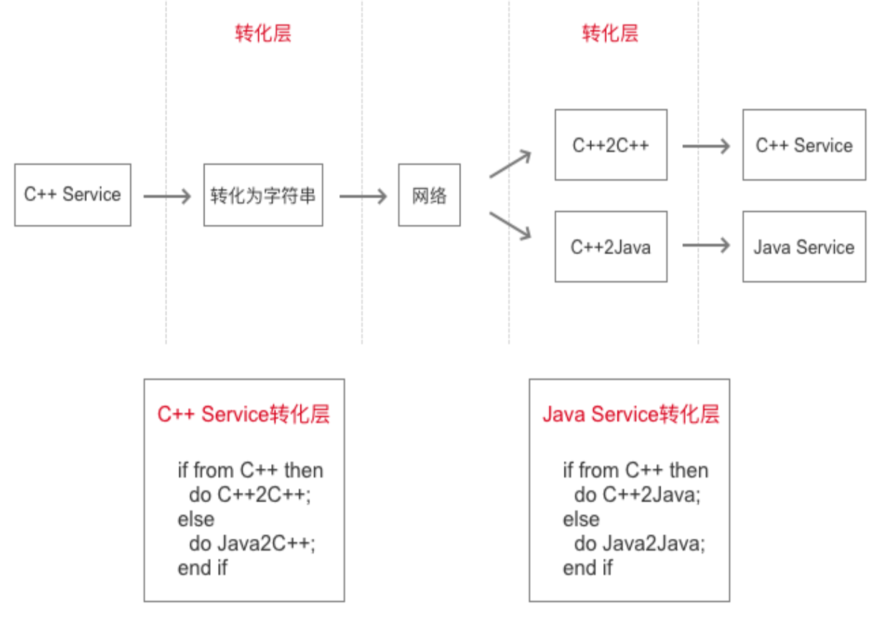
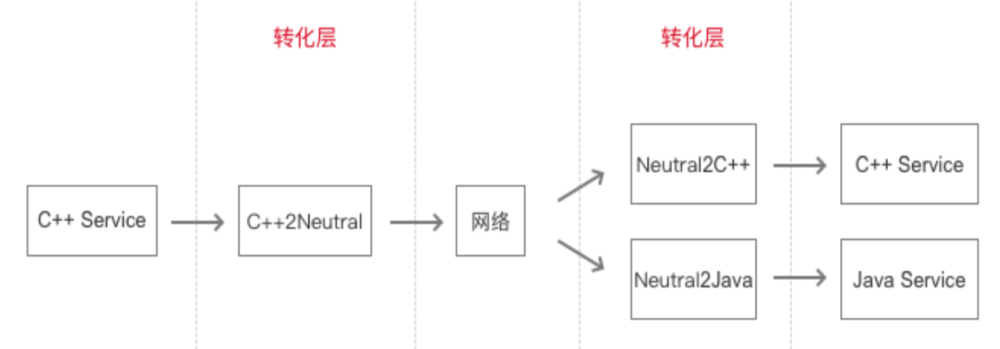

# RPC 序列化

## 什么是序列化

序列化（Serialization）指把数据结构或对象状态转化为可存储的或可传输的结构，并且这种结构可以用来重建数据结构或对象状态。

## 为什么要序列化

首先，数据经过序列化之后才能通过网络进行传输。**这是第一层面**。

再者，随着公司快速发展壮大，技术栈有可能因为历史原因出现分化，为了不同的技术栈服务能够相互打通，就需要经过`序列化和反序列化`来进行**转化**。**这是第二层面**。

### 初版方案

以 C++服务和 Java 服务为例，两种服务的数据结构不完全一致，数据发送方发送数据的同时要表明编程语言的类型，数据接收方根据编程语言的类型调用相应的转化函数进行转化。

但这个方案扩展性并不好，如果公司继续有其他技术栈比如 Go、nodejs 等服务，那么为了引入新的技术栈服务，所有的项目都需要修改，因此这套方案不够通用。

### 改进方案

数据发送方先把内存中的数据转化成一种`中立数据结构`的数据，然后再发送出去。数据接收方收到数据后把`中立数据结构`转化成自己支持的数据结构即可。无论以后增加什么语言，以前的项目都不需要修改。

RPC 框架采用的就是此方案。通过`中立数据结构`来解决跨编程语言交换数据的问题。

- 把内存中数据转化成`中立数据结构`的数据的过程叫做**序列化**。
- 把`中立数据结构`的数据转化成自己需要的数据结构的过程叫做**反序列化**。
- 这里的序列化/反序列化是**狭义的**序列化/反序列化，专指 RPC 框架对数据的处理。

## 序列化分类

大致可分为两类：动态序列化 与 静态序列化。

- **动态序列化**：`不需要`提前确定数据的具体类型，调用`通用的序列化函数`将内存中数据转化为中立数据结构的数据。
- **静态序列化**：`需要`提前确定数据的具体类型，调用与具体类型相关的`专用序列化函数`将内存中数据转化为中立数据结构的数据。

## 动态序列化

早期的 RPC 协议一般使用动态序列化，比如 XML-RPC 和 JSON-RPC。

## 静态序列化

现在流行的 **RPC 框架都采用静态序列化的方式**，比如 Thrift 和 Protocol Buffers。开发者先定义好具体的数据类型，然后用工具生成对该数据类型进行序列化/反序列化的代码，最后用生成的代码对数据进行序列化/反序列化。与定义的数据类型不一致的数据无法进行正常的序列化/反序列化。

### Thrift

[Thrift](https://thrift.apache.org/) 是 Facebook 开发的一个 RPC 框架，最早在 2007 年公布。开发者需要先用 Thrift IDL 定义数据类型，然后用 Thrift Compiler 根据定义数据类型生成库代码，最后用库代码完成序列化。 Thrift 支持多种序列化协议：TJSONProtocol、TBinaryProtocol 和 TCompactProtocol。不同的序列化协议得到的中立数据结构都不一样。

### Protocol Buffers

[Protocol Buffers](https://developers.google.cn/protocol-buffers/) 是 Google 在 2008 年左右提出的序列化方法，采用 Varints +ZigZag 编码，卖点是性能高和序列化后的字节数少。后来慢慢发展成为 [gRPC](https://grpc.io/) 框架。与 Thrift 类似，开发者需要先用 Protocol Buffer Language 定义数据类型，然后用 Protocol Buffers Compiler 根据定义数据类型生成库代码，最后用库代码完成序列化。 gRPC-Web 是 gRPC 的 Web 客户端，支持 grpcwebtext 和 grpcweb 两种有线模式（wire format）。

### 静态序列化的特点总结

Thrift 和 Protocol Buffers 在序列化之前都要先定义好具体的数据类型，好处是可以当作接口文档，同时限制数据类型。
Thrift 和 Protocol Buffers 序列化的信息包括数据信息和调用信息。
Thrift 和 Protocol Buffers 序列化后的数据基本不能阅读，即不具备自我描述性。
Thrift 和 Protocol Buffers 序列化后的数据的大小都比较小，其中 Protocol Buffers 更优。
Thrift 和 Protocol Buffers 可以自动生成序列化代码，但是代码的体积不小。

### JSON.stringify(data) 是序列化么？

从第一层面来说，JSON 转化后可以在网络传输，但从第二层面来说，JSON 转化并不是真正的数据序列化转化：

- 虽然 JSON-RPC 和 Thrift 都采用了 JSON 来封装 RPC 信息，但是，它们不仅封装了数据信息，还封装了调用信息；
- 另外，JSON-RPC 和 Thrift 在 JSON 之上还进行了一层处理，比如 Thrift 的 TJSONProtocol 不仅编码了数据值，还编码了数据类型。

因此，真正的数据序列化 与 在使用 HTTP 时调用 JSON.stringify(data) 处理数据还是差别很大的，所以 JSON.stringify(data) 严格意义上来说，并不能算作是序列化。

## 为什么 RPC 在前端用不起来？

- Q：后端基本用 RPC 的方式完成服务之间的调用。RPC 框架，比如 Thrift 和 ProtoBuf，也提供了生成前端代码的能力。那么为什么后端不用 RPC 的方式给前端提供 API 服务呢？
- A：因为不通用。后端没办法要求所有对接的前端都使用 RPC。

- Q：那么前端为什么不愿意使用 RPC 呢？
- A：原因大致如下：
  1. 前端对代码体积很敏感，RPC 生成的代码体积太大了（比如 Protocol Buffers 的两个核心库文件的大小就 195.8KB）。
  2. 前端已经有 HTTP 了，HTTP 的`「Content-Type」`也是独立于编程语言的，就类似于`中立数据结构`，并且前端语言都是 JS，也不需要 RPC 的序列化（序列化还消耗性能），所以没必要用 RPC。
  3. RPC 生成的代码比较古老，难以和流行的前端框架融合。
