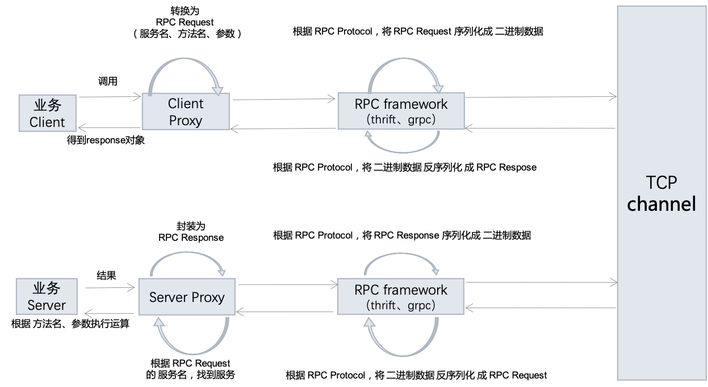
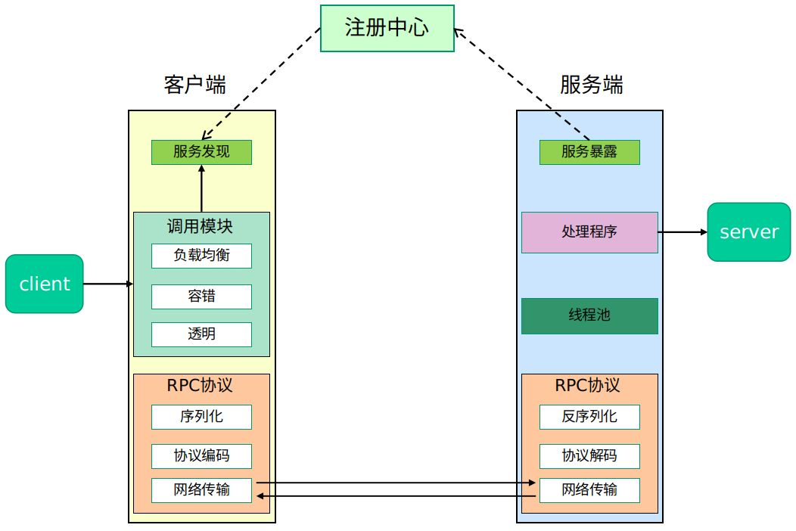
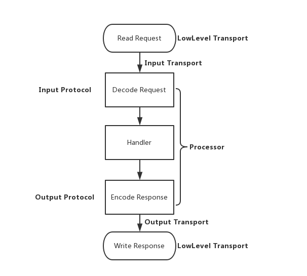

# RPC 远程过程调用

## 什么是 RPC

RPC（Remote Procedure Call）即「远程过程调用」：

- 「过程」也叫方法或函数
- 「远程」就是说方法不在当前进程里，而是在其他进程或机器上面
- 合起来 RPC 就是`调用其他 进程 或 机器上面 的函数`

## 基本原理

RPC 首要解决的是通讯的问题，主流的 RPC 框架分为**基于 HTTP** 和**基于 TCP** 的两种：

- 基于 HTTP 的 RPC 调用很简单，就和我们访问网页一样，只是它的返回结果更单一（JSON 或 XML）。它的优点在于实现简单，标准化和跨语言，比较适合对外提供 OpenAPI 的场景，而它的缺点是 HTTP 协议传输效率较低、短连接开销较大（HTTP 2.0 后有很大改进）。
- 而基于 TCP 的 RPC 调用，由于 TCP 协议处于协议栈的下层，能够更加灵活地对协议字段进行定制，减少网络开销，提高性能，实现更大的吞吐量和并发数。但是需要更多地关注底层复杂的细节，跨语言和跨平台难度大，实现的代价更高，它比较适合内部系统之间追求极致性能的场景。

**一般的 RPC 服务 都是基于 TCP** 的，因为它是目前业界主流 RPC 框架支持的方式。

一个完整的 RPC 架构里面包含了四个核心的组件，分别是 Client ,Server,Client Stub 以及 Server Stub。

| 名称        | 作用                                                                                                 |
| :---------- | :--------------------------------------------------------------------------------------------------- |
| client      | 服务的调用方。                                                                                       |
| server      | 真正的服务提供者。                                                                                   |
| client stub | 客户端存根。存放服务端的地址消息，再将客户端的请求参数打包成网络消息，然后通过网络远程发送给服务方。 |
| server stub | 服务端存根。接收客户端发送过来的消息，将消息解包，并调用本地的方法。                                 |

### RPC 通信流程

- 1. 调用方（Client）通过本地的 RPC 代理（Proxy）调用相应的接口
- 2. 本地代理将 RPC 的服务名，方法名和参数等等信息转换成一个标准的 RPC Request 对象交给 RPC 框架
- 3. RPC 框架采用 RPC 协议（RPC Protocol）将 RPC Request 对象序列化成二进制形式，然后通过 TCP 通道传递给服务提供方（Server）
- 4. 服务端（Server）收到二进制数据后，将它反序列化成 RPC Request 对象
- 5. 服务端（Server）根据 RPC Request 中的信息找到本地对应的方法，传入参数执行，得到结果，并将结果封装成 RPC Response 交给 RPC 框架
- 6. RPC 框架通过 RPC 协议（RPC Protocol）将 RPC Response 对象序列化成二进制形式，然后通过 TCP 通道传递给服务调用方（Client）
- 7. 调用方（Client）收到二进制数据后，将它反序列化成 RPC Response 对象，并且将结果通过本地代理（Proxy）返回给业务代码

::: tip

- 因为在 **TCP 通道**里传输的数据**只能是二进制形式**的，所以我们必须将数据结构或对象转换成二进制串传递给对方，这个过程就叫`「序列化」`。
- 而相反，我们收到对方的二进制串后把它转换成数据结构或对象的过程叫`「反序列化」`。
- 而序列化和反序列化的规则就叫`「协议」`。

:::

### RPC 服务应用场景

相比于 HTTP 协议，RPC 协议能够更快速，更稳定地提供服务。这在使用 serverless 的场景下（在大公司 serverless 的场景居多）非常有优势。在后端微服务化的大势下，不论是从服务效率、服务稳定性，还是从代码可接入性、代码可维护性的角度看，使用 RPC 开发统一的服务能力，都比使用 HTTP 协议方便得多。

## RPC 框架

RPC 框架把我们从「**直接操作 TCP 协议中传输的 buffer**」中解放出来，能够较为方便地搭建 RPC 服务。

完整的 RPC 框架：在一个典型 RPC 的使用场景中，包含了服务发现、负载、容错、网络传输、序列化等组件，其中「RPC 协议」组件是 RPC 的核心功能，其指明了程序如何进行网络传输和序列化。

### RPC 框架分类

#### 绑定语言的框架

跟语言平台绑定的开源 RPC 框架主要有以下几种：

- Dubbo：仅支持 Java 语言。国内最早开源的 RPC 框架，由阿里巴巴公司开发并于 2011 年末对外开源。
- Motan：仅支持 Java 语言。微博内部使用的 RPC 框架，于 2016 年对外开源。
- Tars：仅支持 C++ 语言。腾讯内部使用的 RPC 框架，于 2017 年对外开源。
- Spring Cloud：仅支持 Java 语言。国外 Pivotal 公司 2014 年对外开源的 RPC 框架，

#### 跨语言的框架

跨语言平台的开源 RPC 框架主要有以下几种：

- `gRPC`：Google 于 2015 年对外开源的跨语言 RPC 框架，支持**多种语言**。
- `Thrift`：最初是由 Facebook 开发的内部系统跨语言的 RPC 框架，2007 年贡献给了 Apache 基金，成为 Apache 开源项目之一，支持**多种语言**。

### RPC 框架选择

作为 JSer，我们重点关注下跨语言（支持 nodejs）的两个 RPC 框架 gRPC 与 Thrift。

#### Google gRPC

**原理**：`基于 HTTP/2 协议实现的`，是通过 IDL（Interface Definition Language）文件定义服务接口的参数和返回值类型，然后通过「代码生成程序」生成服务端和客户端的具体实现 SDK 代码，这样在 gRPC 里，客户端应用可以像调用本地对象一样调用另一台服务器上对应的方法。

- **通信协议**：采用了 HTTP/2，因为 HTTP/2 提供了连接复用、双向流、服务器推送、请求优先级、首部压缩等机制。相比于 HTTP/1 有着更高的效率。
- **序列化和反序列化**：使用了 `ProtoBuf（PB协议）`，ProtoBuf 是由 Google 开发的一种数据序列化协议，它的压缩和传输效率极高，语法也简单。
- **多语言支持**：能够基于多种语言自动生成对应语言的客户端和服务端的代码。

#### Apache Thrift

用得比较多，所以下面单独开一个大章节介绍一下...

## Thrift

Thrift 是一套包含序列化功能和支持服务通信的 RPC 框架，主要包含三大部分：代码生成、序列化框架、RPC 框架。

### 代码生成

**原理**：`基于 TCP 协议实现的`，为了支持多种语言，跟 gRPC 一样，Thrift 也有一套自己的接口定义语言 IDL（Interactive Data Language，交互式数据语言），可以通过代码生成器，生成各种编程语言的 Client 端和 Server 端的 SDK 代码，这样就保证了不同语言之间可以相互通信。代码生成 的 Thrift IDL 语法参考[官方 IDL 语法文档](https://thrift.apache.org/docs/idl.html)。

Thrift 支持数据类型

- 简单数据类型：'bool' | 'byte' | 'i8' | 'i16' | 'i32' | 'i64' | 'double'
- 复合数据类型: 'string' | 'binary' | 'map' | 'set' | 'list' | 'struct'
- 特殊数据类型: 'void' | 'stop'
- PS: i8 和 binary 类型有些语言没有实现，建议 i8 使用 byte 或者 i16 替换，binary 使用 `list<byte>`替换，后面不对 i8 和 binary 实现进行分析

### 序列化框架

大部分场景下我们只是将 Thrift 当成一个 RPC 框架来使用的，但其实，Thrift 还是一个支持跨语言的序列化框架，可对标 JSON、Protobuf。

Thrift 支持多种序列化格式：如 Binary、Compact、JSON、Multiplexed 等。

### Thrift RPC 通讯框架

::: warning
前面讲 Binary 和 Compact 序列化的时候，特别指出是序列化协议，但 Thrift 实现的时候没有区分那么明显，我们一般说的 BinaryProtocol 和 CompactProtocol 实现其实就是通讯协议（可以理解里面包含了序列化协议），就是在序列化协议基础上添加了 Message 传输的协议部分。

之所以分开讲，是为了更好理解 Thrift 不仅仅是 RPC 框架还是个序列化框架。
:::

序列化只是解决了跨语言数据交换格式的问题，但是如何通讯呢？我的通讯协议如何设计？我的传输如何设计？我的网络模型如何呢？Thrift RPC 整个网络服务一般都有五个步骤：

- **通讯协议实现**：以常见的 HTTP 协议为例，其主要含三部分：路由信息(URL) + 控制信息(Header) + 数据负载(Body)，Thrift 通讯协议也类似。以最常用的 BinaryProtocol 通讯协议为例：

  - BinaryProtocol 分为严格模式和非严格模式，严格模式下会带上版本 Version 信息，非严格模式没有版本，默认为严格模式。
  - 其中通讯的消息类型主要有四种 typeId:
    1. CALL：值为 1, 请求；
    2. REPLY：值为 2，响应；
    3. EXCEPTION：值为 3，异常；
    4. ONEWAY：值为 4，无返回值请求。

- **Transport 实现**：Transport 主要分为两类，一类是上层传输通道，负责消息的读写和存储；另一类是底层传输通道，负责消息在 client/server 之间的传输。

  - 上层传输通道：主要有两种实现
    - TBufferedTransport，主要场景是在 BIO（阻塞 IO）下使用；
    - TFramedTransport 主要使用场景是在 NIO(非阻塞 IO）使用。
  - 下层传输通道：最常用的有两种实现方式
    - 基于 TCP，我们大部分 RPC 服务就是使用 TCP 实现的；
    - 基于 Unix Socket，比如 Frontier。

- **Server 实现**：服务端支持多种处理方式：如：
  1. Simple：TSimpleServer（单进程单线程模式，调试使用）；
  2. Thread Pool：TThreadPoolServer（单进程多线程模式）；
  3. Process Pool：TProcessPoolServer（多进程单线程模式，Pie 目前采用这种）；
  4. Non-Blocking：其他基于 NIO 的各种 Server。
  - 由于 Server 实现不用考虑跨语言问题，因此只需关心实现语言自身特点选用就可以了。

如果要使用 Nodejs 开发 RPC 服务的话，使用 thrift 是一个不错的选择。它既提供了跨语言的支持，又拥有着不错的性能，而且序列化方式是支持二进制和 json 的，非常适合使用 Nodejs 进行开发。

::: tip Apache Thrift vs FBThrift
Apache Thrift（简称 Thrift）最开始也是 FB 开源的，但是 FB 又另起炉灶开发了 FBThrift，两者核心内容是一样的。

简单来说，FBThrift 功能更多更强，性能也更好，比如 FBThrift 支持更多种压缩格式的 Transport，还有 THeaderProtocol（带头部的协议），新的异步 C++ Server 等等，如果重头来建议考虑使用 FBThrift。
:::

## 参考文章

- [一文带你了解使用 Nodejs 开发 RPC 服务](https://blog.csdn.net/u011748319/article/details/107663088)
- [聊聊 Node.js RPC（一）— 协议](https://www.yuque.com/egg/nodejs/dklip5)
- [6 种微服务 RPC 框架，你知道几个？](https://blog.csdn.net/feilang00/article/details/102552585)
- [gRPC vs Thrift](https://blog.csdn.net/dazheng/article/details/48830511)
