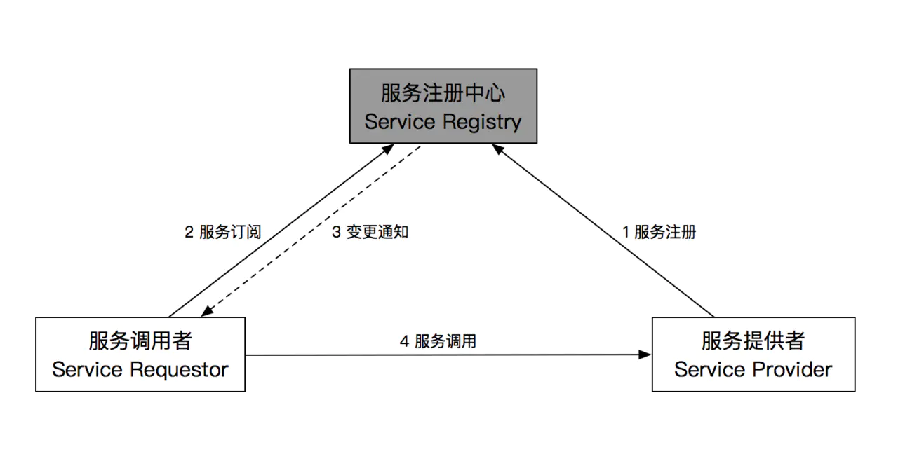
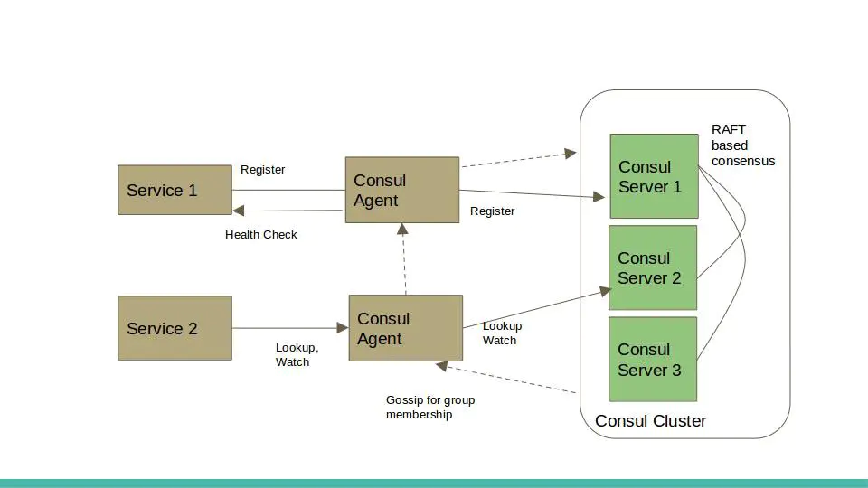

# Service Discovery 服务发现

「服务发现」就是通过`服务唯一标识`来**获取服务地址**的过程。

## 为什么需要服务发现

正常情况下当我们要访问服务时需要知道服务实例地址和端口，如果服务实例地址和端口都是固定的我们可以直接将其配置在文件中使用。

但大多数线上生产环境，尤其容器部署情况下服务实例地址都是动态分配的，只有当服务实例实际部署之后才能获得地址，服务调用者根本无法提取获取服务实例地址和端口，只能在运行时通过服务发现组件解析服务名来获取服务实例地址和端口。

## 什么是服务发现

简单讲就是，`通过服务名找到提供服务的实例地址和端口`，主要用于解决如何获取服务实例地址问题。

近年来随着容器技术的兴起，大量服务分散在系统各处，服务彼此之间调用都需要通过服务发现来实现。服务发现是`分布式系统`中不可或缺的关键组件。

## 服务发现的分类（以负载方式区分）

### 硬负载

依靠硬件设备做负载，在调用链路上加一个独立部署的硬件设备（一般就是我们所熟知的 F5/LVS/HAproxy 集群），通过它们对后端的服务进行发现，对流量进行`负载均衡（Load Balancer）`。

```
                                                +------------+
+----------+  invoke   +---------------+        |  Services  |-+
| Consumer | --------> | Load Balancer | -----> |  Providers | |-+
+----------+           +---------------+        +------------+ | |
                                                 |-------------+ |
                                                   +-------------+
```

- 优点：存在一个统一的流量集中化节点，可以实现一些全局性的掌控，比如路由、鉴权、安全防控等等。
- 缺点：
  - 硬负载设备的成本高，不易维护；
  - 在调用主链路上有一定性能损耗；
  - 硬负载设备需要实现集群化部署的模式以解决单点故障的问题。

### 软负载

依靠软件方式进行服务发现和负载均衡：

- 没有了中心化的硬负载设备，把 `负载均衡（Load Balancer）` 的功能以 SDK 的模式集成到服务消费方的进程里；
- 引入了注册中心（Service Registry），用来动态管理所有的服务地址；
- 注册中心不在调用的主链路上，它在旁路。

```
                  +------------------+
                  | Service Registry |
                  +------------------+
                   /                ^
                  /                  \
           Discover          Register & Keep Alive
             /                               \
            /                                 \
           v                                   \
  +----------+                                +----------+
  | Consumer | ---- Load Balance & Invoke --> | Provider |
  +----------+                                +----------+
```

- 优点：
  - Consumer 直接调用 Provider，不再有中间节点；
  - 不需独立的负载均衡设备，也就不存在成本和运维的问题；
- 缺点：
  - 对 Consumer 端有侵入性，存在接入成本；
  - 去中心化，所以弱管控；
  - 虽然注册中心在旁路，但也是一个关键的基础设施，需要确保高可用；

## 常见服务发现解决方案（服务发现组件）

- 硬负载
  - 阿里云的 SLB
  - AWS 的 ELB
- 软负载
  - Eureka
  - Zookeeper、Etcd、Consul
  - 阿里和蚂蚁的 ConfigServer

**在 RPC 里我们通常采用`软负载`来做服务发现**。常用于构建服务发现解决方案的开源框架如 Zookeeper、Etcd、Consul。

## 服务发现的架构



标准的服务发现架构主要有三部分组成：

- 服务注册中心 ( Service Registry )：管理所有注册信息的，后面简称 Registry
- 服务提供者 ( Service Provider )：提供服务给别人调用的，后面简称 Provider
- 服务调用者 ( Service Requestor )：调用别人的服务的，后面简称 Requestor

主要有通用的四种调用方式：

- 服务注册：注册 Provider 信息，如绑定域名
- 服务订阅：监听 Provider 变更
- 变更通知：通知 Requestor，Provider 发生变更
- 服务调用：调用 Provider，如 http 请求

### 服务注册中心

`服务注册中心（Service Registry）`是服务发现的核心组件，本质是一个**服务名和服务实例地址映射集合**，主要提供基本的`（1）服务名解析功能`。除此之外还提供如下能力：

- `（2）容错（Fault Tolerance）`：服务注册中心保存了分布式系统中所有服务名与服务实例地址映射，一旦故障必将导致整个系统不可用，是整个分布式系统核心，必须具备高可用性；
- `（3）健康检查（Health Check）`：服务注册中心必须要能及时发现故障实例并将其注销以防止被错误访问；
  - 方式一般分两种
- `（4）监视器（Watcher）`：服务注册中心必须具备及时通知服务调用者服务实例注册或注销的能力，以便服务调用者及时采取措施。

::: tip 「健康检查」的实现

服务注册中心不同于一般的动态配置系统，因为服务是有状态的（至少包含可用和不可用两种状态）。在服务发布成功以后，还需要持续通过健康检查来确保服务是可用的。

`1、通过心跳`
服务提供方和注册中心通过定时发送心跳包来维护一个长连接，只要长连接不断，就代表服务可用。

- 优点
- 对业务透明，实现也比较简单
  - 可以确保至少网络连接是通的
- 缺点
  - 粒度较粗，无法检查实际业务是否健康
  - 对于注册中心来说需要维护大量长连接

Zookeeper, 阿里的 ConfigServer 都采用这种方式来做健康检查

`2、暴露接口用于定时检查`
服务提供方单独暴露一个接口给注册中心来轮训，根据接口的返回状态来判断服务是否可用

- 优点
  - 业务可以自定健康标准，做更精确的健康检查
  - 不用维护长连接
- 缺点
  - 对业务有一定侵入

K8s 里的 Health Checks 就是这种方式

:::

::: tip 「注册」或「注销」服务实例

「注册」或「注销」服务实例一般有两种选择：

- `Self-Registration 模式`：服务实例自己注册，在服务实例启动成功后主动将自己注册到服务注册中心，这种方法好处是架构简单但需要为服务用到的每种编程语言实现注册代码；
- `Third-party Registration 模式`：通过其他组件来注册服务实例，例如使用一个独立 Agent 通过轮询或监听事件去跟踪运行的服务实例变化进行注册或注销，好处是服务实例与服务注册中心解耦但引入第三方组件增加了架构复杂性。
  :::

## Consul



Consul 是一个成熟的服务发现解决方案。其核心是一个**基于 `Raft 共识算法`具备`线性强一致性`的 `Key-Value 存储系统`**作为**服务注册中心**。

并提供**代理（Agent）机制**，一方面用于协调服务注册，一方面提供服务健康检查。代理（Agent）会在每个运行服务的节点上启动，获取节点地址并将该服务实例注册到服务注册中心。

**架构上 Consul 包括两类组件：Server、Agent**。

- 服务注册信息保存在 Server 上，通过 Raft 共识算法保证多个 Server 间数据线性强一致，保证服务注册中心高可用；
- 将所有 Agent 作为集群节点，使用 `Gossip 协议`进行`组关系管理和故障探测`，当有 Agent 加入（启动）或离开（故障）集群时其他 Agent 会得到通知，实现服务健康检查和监视功能。
  - Gossip 协议常用于集群组关系管理和故障检测，每个节点都通过一个或多个引导节点加入集群，引导节点有集群中所有节点列表，每个节点都从自己所知节点列表中随机选择一组节点周期性地发送多播消息，最终集群中所有节点都能知道其他节点。这个过程看起来很神奇，实际上 Gossip 协议能在几秒内将消息传遍有上百节点的集群。Akka、Riak、Cassandra 都使用 Gossip 协议维护集群成员列表和故障探测。

Consul 和 Etcd 都非常适合容器环境，因为 Docker 容器启动、停止都会发送事件（Event），`基于事件通知机制`非常便于将服务实例从 Consul 或 Etcd 上注册、注销。

## 参考文章

- [分布式系统之服务发现（Service Discovery）](https://juejin.cn/post/6844903937653342216)
- [聊聊 Node.js RPC（二）— 服务发现](https://www.yuque.com/egg/nodejs/mhgl9f)
