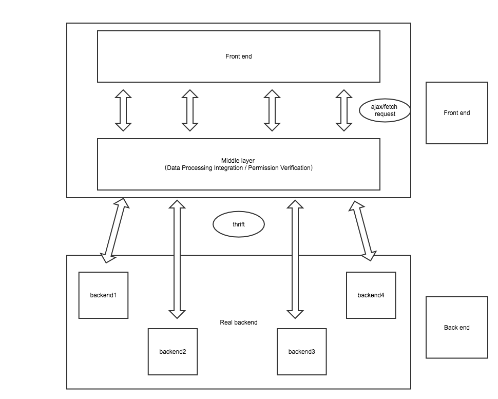
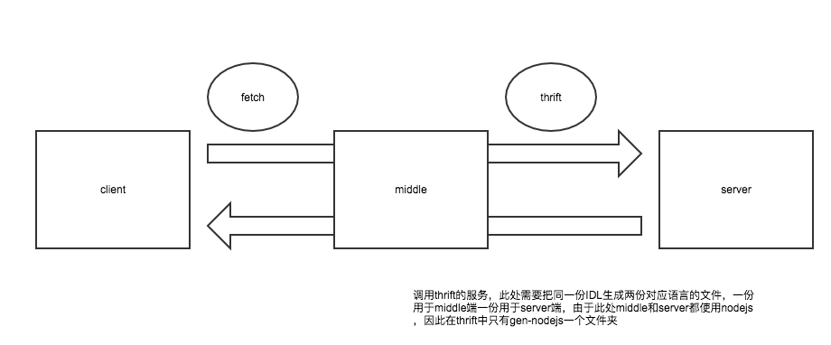

# Thrift 上手指南

> 此文章是[Thrift 前端上手实例](https://zhuanlan.zhihu.com/p/27589566)的摘要。

## BFF（Thrift 协议）项目架构



## 目录结构

```bash
# 使用node作为服务端的开发语言，
-|
 |- client                 // 前端，使用vue-cli快速搭建
 |
 |- middle                 // 中间层BFF，koa做router处理, thrift连接真正的后端
 |
 |- server                 // 真正的后端，通常会使用java、go等一些稳定高效的后端语言，为了方便这里也用nodejs实现
 |
 |- thrift -|              // 存放与thrift相关文件的文件夹
            |
            |- gen-nodejs  // 存放.js文件的文件夹
            |
            |- .thrift     // 存放.thrift文件的文件夹
```

## 代码实现

[thrift.apache.org - Node.js Tutorial](https://thrift.apache.org/tutorial/nodejs.html)

### 编写 Thrift IDL

Thrift 有一套自己的接口定义语言 IDL（Interactive Data Language，交互式数据语言），可以通过代码生成器，生成各种编程语言的 Client 端和 Server 端的 SDK 代码，这样就保证了不同语言之间可以相互通信。代码生成 的 Thrift IDL 语法参考[官方 IDL 语法文档](https://thrift.apache.org/docs/idl.html)。

```t
# list.thrift

// Data数据结构
struct Data {
  1: string code,
  2: string msg,
  3: list<List_Item> content
}

struct List_Item {
  1: string name,
  2: string words,
  3: string date
}


service SaveList{
  // ping方法
  void ping(),
  // 返回值为Data数据结构的save方法
  Data save(1:string name, 2:string words, 3:string date)
}
```

### 生成工具文件

通过命令，生成工具文件：

```bash
thrift -r --gen js:node list.thrift
```

在当前文件夹下生成如下工具 js 文件：

```bash
-|
 |- gen-nodejs
    |- list_types.js    // 以 list.thrift 的名称list + 下划线的types
    |- SaveList.js      // IDL 中 service 的名称
```

### 前端代码

::: details

```vue
<template>
	<div id="app">
		<h1>Thrift</h1>
		<div>
			<input type="text" placeholder="username" v-model="username" />
			<input type="text" placeholder="words" v-model="words" />
			<button v-on:click="submit">提交</button>
		</div>
		<div class="list" v-for="item in list">
			<div>
				<p>words: {{ item.words }}</p>
				<p>name: {{ item.name }}</p>
				<p>status: success</p>
				<p>date: {{ String(new Date(parseInt(item.date))) }}</p>
			</div>
		</div>
	</div>
</template>

<script>
export default {
	name: "app",
	data() {
		return {
			username: "",
			words: "",
			list: []
		};
	},
	methods: {
		submit: function(event) {
			fetch("http://localhost:3001/", {
				method: "POST",
				mode: "cors",
				headers: {
					Accept: "application/json",
					"Content-Type": "application/json"
				},
				body: JSON.stringify({
					username: this.username,
					words: this.words
				})
			})
				.then(res => res.json())
				.then(data => {
					console.log(data);
					this.list = data.content;
				});
		}
	}
};
</script>
```

:::

### 中间层代码

::: details

```js
// app.js
const Koa = require("koa");
const router = require("koa-router")();
const cors = require("koa-cors");
const koaBody = require("koa-body");

const index = require("./router/index");

const app = new Koa();

// 由于起了三个服务，端口不同，所以需要跨域
app.use(cors());

// 使用koaBody包可以在post请求时通过ctx.request.body.xxx获取参数
app.use(koaBody());

// 引入router文件中的路由
router.use("/", index.routes());
app.use(router.routes());

// 在3001端口起服务
app.listen(3001);
```

```js
// router/index.js
const router = require("koa-router")();
const thrift = require("thrift");
const SaveList = require("../../thrift/gen-nodejs/SaveList");
// const ttypes = require("../../thrift/gen-nodejs/list_types");
const createConnection = require("../utils/createConnection").createConnection;

router.post("/", async (ctx, next) => {
	// 因为复用度高，把创建connection的代码提取成一个方法
	const connection = createConnection();

	// 创建thrift服务
	var client = thrift.createClient(SaveList, connection);

	// thrift文件中定义的ping方法
	await client.ping(function(err, response) {
		console.log("ping in middle");
	});

	const date = Date.parse(new Date());

	// thrift文件中定义的save方法
	// 使用promise，等待回调函数执行完后返回response
	// 方式可能不是很优雅，之后可能进行封装
	ctx.body = await new Promise((resolve, reject) => {
		client.save(
			ctx.request.body.username,
			ctx.request.body.words,
			String(date),
			function(err, response) {
				console.log("middle get response from server:", response);
				resolve(response);
			}
		);
	});

	// 返回给前端的参数
	return ctx.body;
});

module.exports = router;
```

```js
// utils/createConnection.js
const thrift = require("thrift");

exports.createConnection = function() {
	var transport = thrift.TBufferedTransport;
	var protocol = thrift.TBinaryProtocol;

	var connection = thrift.createConnection("localhost", 3002, {
		transport: transport,
		protocol: protocol
	});

	connection.on("error", function(err) {
		assert(false, err);
	});

	return connection;
};
```

:::

### 后端

::: details

```js
var thrift = require("thrift");
var SaveList = require("../thrift/gen-nodejs/SaveList");
// var ttypes = require("../thrift/gen-nodejs/list_types");
var Data = require("../thrift/gen-nodejs/list_types").Data;
var List_Item = require("../thrift/gen-nodejs/list_types").List_Item;

// 直接定义一个变量用来存储客户端发送的数据
var list = [];

// 创建一个thrift服务
var server = thrift.createServer(SaveList, {
	// 在idl中定义的ping方法
	ping: function(result) {
		console.log("ping in server");
		result(null);
	},

	// 在idl中定义的save方法
	save: function(name, words, date, result) {
		console.log("server get data from middle:", name, words, date);

		// 在给list push元素时需要调用 idl中的new方法，不然在new Data()时会报错
		list.push(
			new List_Item({
				name: name,
				words: words,
				date: date
			})
		);

		// 定义返回值并返回
		const data = new Data({
			code: "S01",
			msg: "success",
			content: list
		});
		result(null, data);
	}
});

server.listen(3002);
```

:::

## 流程演示

1. 通过 npm run server 启动 server 端的服务；
2. 通过 npm run middle 启动中间层 BFF 的服务；
3. cd client，执行 npm run dev 来启动前端应用；


