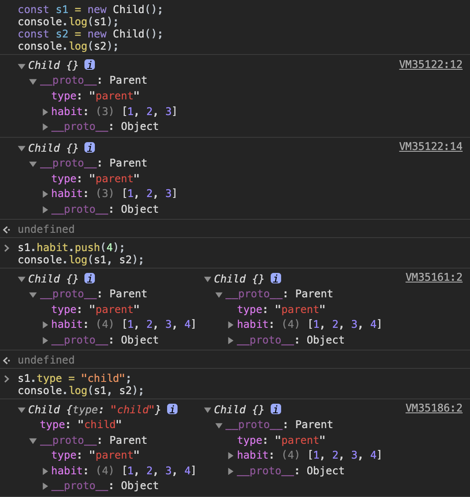
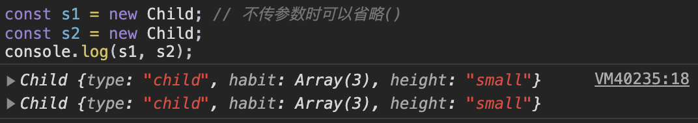
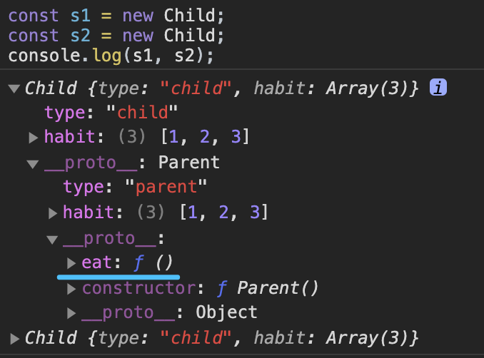

# 类与继承

> JS中继承的本质就是通过`原型链`
## 继承的几种方式

### 1、原型链实现 继承
```js {9}
function Parent() {
    this.type = "parent";
    this.habit = [1, 2, 3];
}

function Child() {
}

// const s1 = new Child();
// console.log(s1.type);  // undefined，这里注意在原型链改变之前实例化s1的话，s1的原型链就断了

Child.prototype = new Parent();

const s1 = new Child();
console.log(s1);
const s2 = new Child();
console.log(s2);


s1.habit.push(4);
console.log(s1, s2);

s1.type = "child";
console.log(s1, s2);
```

#### 控制台输出结果


#### 解释
原型链中的原型对象Parent，对于多个实例如s1与s2来说是共有公用的。由于构造函数Child是空对象，所以实例s1与s2开始是没有实例属性的。
1. 当给s1.habit增加一个4，由于habit是引用类型，实例中没有该属性，则会通过原型链添加到原型对象Parent中的habit上，而它是共有的，所以s1.habit访问时也会到达原型对象的habit（`s2.__proto__ === s1.__proto__`）；
2. 当给s1.type赋值时，由于type是个原始类型属性，所以相当于是在实例s1中添加了实例属性type="child"，而不会去改变原型对象，所以s1.type==="child"，而s2.type==="parent"；
::: warning 结论
综上，原型链继承的缺点是：**原型上任何类型的属性值都不会通过实例被重写，但是引用类型的属性值会受到实例的影响而修改**，所以引用类型的属性值可能被误操作而导致所有实例都改变。
:::

### 2、借用构造函数 继承

```js {7}
function Parent() {
    this.type = "parent";
    this.habit = [1, 2, 3]
}

function Child() {
    Parent.call(this);
    this.type = "child"; // 这里因为与Parent有同名属性type且后执行，会覆盖Parent.中的type
    this.height = "small";
}

Parent.prototype.say = function() {
    console.log("Hello~")
}

const s1 = new Child; // 不传参数时可以省略()
const s2 = new Child;
console.log(s1, s2);
```

#### 控制台输出结果


#### 原理
- 我们知道，函数只不过是一段可以在特定作用域执行代码的特殊对象，我们可以通过 call或apply 方法指定函数的作用域；
- 借用构造函数继承，就是`在子类的构造函数中，通过 apply() 或 call()的形式，调用父类构造函数，以实现继承`；
- 子类构造函数创建的实例s，会调用父类构造函数`生成属性副本`，从而实现继承父类实例属性，且`多实例间互不影响`。但对于父类原型对象上的属性无法继承，比如上面的say()方法，因此只能算是`部分继承`；

::: warning 结论
综上，借用构造函数继承的缺点是：**只实现了部分继承，父类的原型对象上的属性无法被子类继承**。
:::

### 3、组合继承（原型链+借用构造函数）

组合继承：结合借用构造函数拷贝属性副本，与原型链继承共有属性（即`将需要复用的方法提出到父类的原型对象上去挂载`）相结合，从而更好实现继承。

```js {7,10,14}
function Parent() {
    this.type = "parent";
    this.habit = [1, 2, 3];
}

//将需共享的方法放到 Parent.prototype 中，实现复用
Parent.prototype.eat = function () { console.log('吃吃喝喝') }

function Child() {
    Parent.call(this);
    this.type = "child"
}

Child.prototype = new Parent();

const s1 = new Child;
const s2 = new Child;
console.log(s1, s2);
```
#### 控制台输出结果


#### 组合继承优化

需要优化的点有两个：
1. 解决Parent执行两次的问题：`Parent.call(this)`与`new Parent()`执行了两次，是没有必要的。**继承的本质就是将父类的原型对象引用到子类的原型对象上**，因此可以简化构造函数执行过程，直接将父类原型对象赋值给子类原型对象即可：
```js {7,10,14}
function Parent() {
    this.type = "parent";
    this.habit = [1, 2, 3];
}

//将需共享的方法放到 Parent.prototype 中，实现复用
Parent.prototype.eat = function () { console.log('吃吃喝喝') }

function Child() {
    Parent.call(this);
    this.type = "child"
}

Child.prototype = Parent.prototype; // 替换 new Parent();

const s = new Child;
s.constructor === Parent // true，这里还有遗留问题
```

2. （**完美继承**）解决s.constructor指向问题：优化1中还有个问题没解决就是`实例对象s的构造函数依然是父类Parent`。可以通过引入一个中间对象，来隔离子类原型对象与父类原型对象，并手动改变子类原型的构造器为自己本身：
```js {7,10,14-15}
function Parent() {
    this.type = "parent";
    this.habit = [1, 2, 3];
}

//将需共享的方法放到 Parent.prototype 中，实现复用
Parent.prototype.eat = function () { console.log('吃吃喝喝') }

function Child() {
    Parent.call(this);
    this.type = "child"
}

Child.prototype = Object.create(Parent.prototype); // 使用 Object.create(父类原型对象)创建一个以父类原型为原型对象的中间对象
Child.prototype.constructor = Child; // 手动改变实例s的原型对象构造器指向

const s = new Child;
s.constructor === Parent // false
s.constructor === Child // true
```

