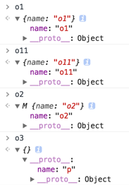
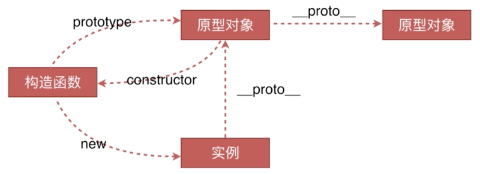
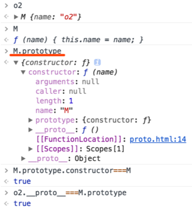
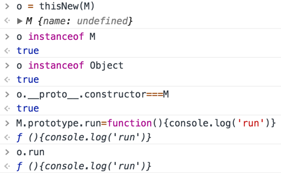

# 原型链与对象

## 创建对象的3种方法

1. 字面量方式
```js
var o1 = { name: 'o1' };
var o11 = new Object({ name: 'o11' });
```

2. 使用“构造函数”
```js
function M(name) {
    this.name = name;
}

var o2 = new M('o2')
```

3. 使用 Object.create
```js
var p = { name: 'p' }

var o3 = Object.create(p);
```

控制台输出：



- o1、o11、o3都是 Object {}，o2是构造函数 M {}；
- o3相比于o1和o11又特殊在：Object.create所创建的是一个空对象，传入的p是此空对象实例的原型对象，即o3.__proto__指向p; 所以o3本身是不具备name属性的，需要访问它对应的原型对象p上的name属性。

## 构造函数、实例、原型对象 间的关系



::: warning
**prototype（显式原型属性）**
**\_\_proto\_\_（隐式原型属性）**
:::


#### 解释


- M是构造函数
- o2是M的实例
- M.prototype是M的原型对象
- 原型对象中有个constructor属性指向M
- 实例o2中有个__proto__属性指向原型对象M.prototype
- 注意：`对象(不管是实例对象还是原型对象)都有__proto__属性，但只有构造函数才有prototype属性`。
- 注意：`构造函数其实也是对象，所以构造函数也有__proto__属性`：
    ```js
        M.__proto__ === Function.prototype // true
        // 构造函数M是Function这个构造函数的一个实例。
    ```

## 什么是原型链

### 定义
实例通过__proto__属性指向它对应的原型对象，此原型对象当中也有__proto__属性指向其对应的原型对象，这样一层层向上形成链式结构，直至`Object.prototype`原型对象便到达`原型链的顶端`。

### 原型链的工作原理
原型对象上的方法是被不同的实例所共有的，这就是原型链的作用。
也就是说，当一个实例在访问一个属性的时候，先在自身找是否存在此属性，如果没有就向上一级查询自己的原型对象，如果没有就继续向上一级查询原型对象，直到找到此属性或者到达原型链的顶端，这就是`原型链的工作原理`。

## new运算符工作原理

### new的工作步骤
- 步骤一：创建新实例对象o，关联构造函数M的原型对象；
- 步骤二：执行构造函数M，并绑定M的作用域上下文到新实例对象o上；
- 步骤三：判断步骤二中返回的res是否为(广义上)对象，如果是对象则抛弃o返回res；如果不是对象则返回o。

### 代码模拟
```js
var thisNew = function(M) {
    // Object.create()返回空对象o，并关联M的原型对象
    var o = Object.create(M.prototype);
    // 执行构造函数M，并绑定作用域到o上
    var res = M.call(o);
    // 判断res是否是广义上的对象，是则返回res，否则返回o
    if (typeof res === "object") {
        return res;
    } else {
        return o;
    }
}
```
验证模拟的代码是否能完成new运算符的功能：

 
 
即使是再在M的原型对象上追加run方法，通过我们模拟的thisNew所创建的实例o也具备run方法。从而证明了new运算符背后的工作原理。


