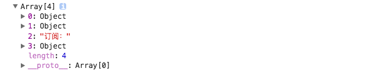

# 关于props.children的一切

## 组件的props.children是指什么？

React支持在自定义组件时，在其中嵌套 JSX 结构。嵌套的结构在组件内部都可以通过 `props.children` 获取到，这种组件编写方式在编写容器类型的组件时非常有用：
```jsx
class Card extends Component {
  render () {
    return (
      <div className='card'>
        <div className='card-content'>
          {this.props.children}
        </div>
      </div>
    )
  }
}

ReactDOM.render(
  <Card>
    <h2>React.js</h2>
    <div>开源</div>
    订阅：<input />
  </Card>,
  document.getElementById('root')
)
```
`props.children`打印结果如下：



React.js 把嵌套的 JSX 元素一个个都放到数组当中，然后通过 `props.children` 传给了 Card。


## React.Children 操纵子元素

**React.Children** 提供了用于处理 this.props.children 不透明数据结构的辅助方法。

*这里的`“不透明”`，代表 this.props.children 可以是任何类型，例如数据，函数，对象，等等。因此你可以传递任何东西。*

props.children类似于vue中插槽，插入的child可以是任意类型。并且，插入不同的内容可能会得到不同类型的props.children
- 当不插入内容或内容为换行符时，props.children为**undefined**
- 当插入多个内容时，props.children为**Array**（`多个文本视为一个内容`）
- 当插入一个内容时，props.children为**插入值**

因为 props.children并不一定为数组，所以在使用数组方法时记得要判断是否为数组，或者使用帮助方法 React.Children.map 和 React.Children.forEach，这样即使不是数组也不会报错。

### 1、遍历当前组件的children
```jsx
React.Children.map(children, function(child, i) {}) // 遍历，并返回一个新数组；

React.Children.forEach(children, function(child, i) {}) // 只遍历
```

### 2、传递不同类别的children有何区别？如何获取children的数量？

- 如果传递一个字符串或者函数作为子元素，将打破`this.props.children.length`的正常使用：比如有一个后代，“Hello World.”，但是`this.props.children.length`相反却输出12!
- 而不管子元素是什么类型，`React.Children.count(children)`都可以准确地返回 children 中的组件总数量，等同于通过 map 或 forEach 调用回调函数的次数。

```js
const ChildCount = props => Children.count(props.children);

// 下面渲染结果（即props.children的长度是什么）：
<ChildCount>1</ChildCount> // 1
<ChildCount> 1 </ChildCount> // 1
<ChildCount> 1  2 </ChildCount> // 1
<ChildCount> 1  {2} </ChildCount> // 2
```

### 3、在渲染函数中如何操作子节点的集合（数组化）

`React.Children.toArray(children)`，将 children 这个复杂的数据结构以数组的方式**扁平展开并返回**，并为每个子节点**分配一个 key**。当你想要在渲染函数中操作子节点的集合时，它会非常实用，特别是当你想要在向下传递 this.props.children 之前对内容**重新排序**或**获取子集**时。

### 4、验证只有一个子React元素
`React.Children.only(children)`，验证 children 是否只有一个子节点（必须是 React 元素），如果有则返回它，否则此方法会抛出错误。


### 5、修改子元素属性

当想要给多个子元素添加属性时，比如这里为了分组，需要给RadioButton添加相同的name属性：
```jsx
render () {
  return (
    <RadioGroup>
      <RadioButton value="first"> First </RadioButton>
      <RadioButton value="second"> Second </RadioButton>
      <RadioButton value="third"> Third</RadioButton>
    </RadioGroup>
  );
}

// 我们当然可以遍历，然后给每一个单独的RadioButton分配一个name属性。
<RadioGroup>
  <RadioButon name="g1" value="first">First</RadioButton>
  <RadioButton name="g1" value="second">Second</RadioButton>
  <RadioButton name="g1" value="third">third</RadioButton> 
</RadioGroup>
```
我们当然可以这样直接手动给每个RadioButton添加name="g1"属性，但这并不是聪明的做法，我们可以使用React.cloneElement()这样做：

```jsx
class RadioGroup extends React.Component {
    constructor() {
        super();
        this.renderChildren = this.renderChildren.bind(this);
    }
    renderChildren() {
        return React.Children.map(this.props.children, child => {
            return React.cloneElement(child, {
                name: this.props.name
            })
        })
    }
    render () {
        return (
        <div className="group">
            {this.renderChildren()}
        </div>
        );
    }
}

// 此时，只需给我们的RadioGroup组件设置一个唯一name属性值:
<RadioGroup name="g1">
  <RadioButton value="first">First</RadioButton>
  <RadioButton value="second">Second</RadioButton>
  <RadioButton value="three"> Three</RadioButton>
</RadioGroup>
```
