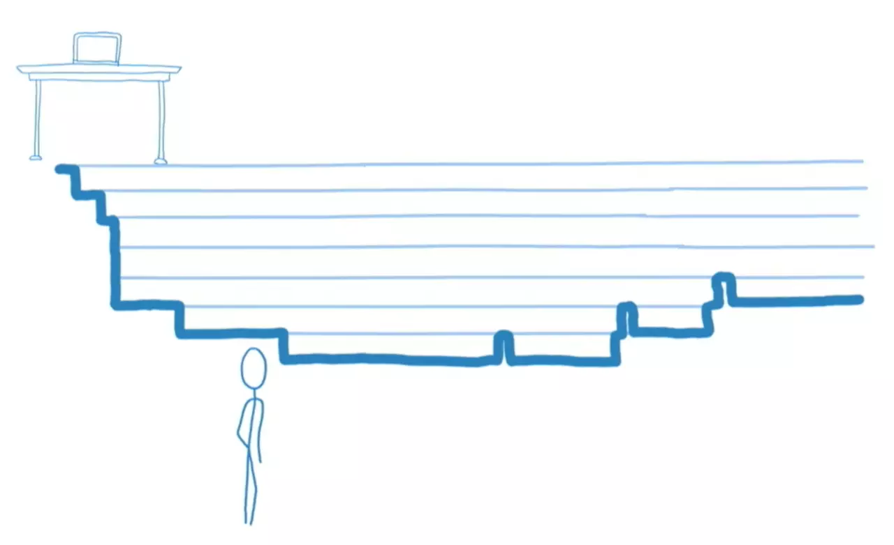
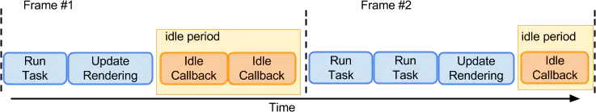
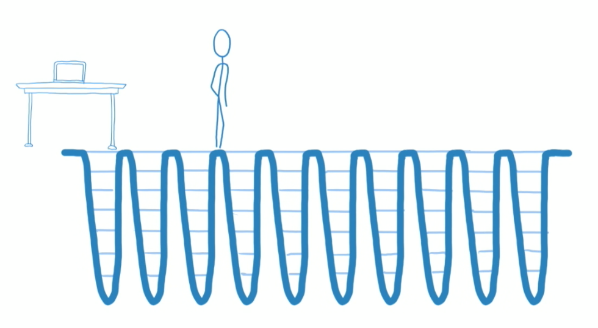

# React Fiber

## Fiber 解决什么问题（主线程阻塞）
VDOM 在操作真正的 DOM 之前，先通过 VDOM 前后对比得出需要更新的部分，再去操作真实的 DOM，减少了浏览器多次操作 DOM 的成本。这一过程，官方起名 `reconciliation`，可翻译为`协调算法`。

- 在 react@15 ，reconciler（stack reconcilation）采用自顶向下递归，更新整个子树。如果组件树不大不会有问题，但是当组件树越来越大，`递归遍历的成本就越高，持续占用主线程`。
- JS引擎线程、GUI引擎线程（页面布局和页面绘制）都是运行在浏览器的主渲染进程当中的，而浏览器的渲染进程在同一时间只能做一件事，所以 JS引擎线程、GUI引擎线程 之间是互斥的。如果 JS 运算持续占用主线程，页面就没法得到及时的更新。
- React 的 stack reconcilation 是**CPU密集型的操作**，**并且整个过程是一气呵成的，不能被打断**，在此期间，React 会霸占着浏览器资源，导致两个问题：
    1. 一则会导致用户触发的事件得不到响应；
    2. 二则会导致掉帧，用户可以感知到这些卡顿（页面元素很多时，整个过程占用的时机就可能超过 16ms (1000ms / 60)，就容易出现掉帧的现象）。



体验一下：[Fiber vs Stack Demo](https://claudiopro.github.io/react-fiber-vs-stack-demo/)

::: tip 前端框架可从 3个方向 解决「主线程阻塞」问题
对于 '前端框架' 来说，解决这种问题有三个方向:
1. 优化每个任务，让它有多快就多快。挤压CPU运算量；
2. 快速响应用户，让用户觉得够快，不能阻塞用户的交互；
3. 尝试 Worker 多线程；

*对于Worker 多线程渲染方案也有人尝试，但要保证状态和视图的一致性相当麻烦。*

#### Vue 选择了1️⃣

因为对于Vue来说，使用模板让它有了很多优化的空间，配合响应式机制可以让Vue精确地进行节点更新（尤雨溪：如果我们可以**把`更新做得足够快`的话，理论上就不需要时间分片了**）；

#### React 选择了2️⃣

为了给用户制造一种应用很快的'假象'，不能让一个程序长期霸占着资源. 你可以将浏览器的渲染、布局、绘制、资源加载(例如HTML解析)、事件响应、脚本执行视作操作系统的'进程'，我们需要**通过某些调度策略`合理地分配CPU资源`**，从而提高浏览器的用户响应速率, 同时兼顾任务执行效率。
:::

## Fiber 工作原理

**解决基本思路**：具体解决主线程长时间被 JS 运算占用这一问题，是将运算切割为多个步骤，分批完成。也就是说在完成一部分任务之后，将控制权交回给浏览器，让浏览器有时间进行页面的渲染。等浏览器忙完之后，再继续之前未完成的任务。

::: tip 可中断/恢复的Fiber
React@15使用的是 **JS 引擎自身的函数调用栈**，它会一直执行到**栈空**为止。

React@16 的 Fiber实现了**自己的组件调用栈**，它以**链表**的形式遍历组件树，让自己的 Reconcilation 过程变成**可中断**的，可以灵活的暂停、继续和丢弃执行的任务。**适时地让出CPU执行权**，可以让浏览器及时地响应用户的交互，并且，给浏览器一点喘息的机会，他会对代码进行编译优化（JIT）及进行热代码优化，或者对reflow进行修正。
:::

浏览器在一帧内可能会做执行下列任务，而且它们的执行顺序基本是固定的:
1. 处理用户输入事件
2. Javascript执行
3. 调用rFA （requestAnimationFrame）
4. 布局 Layout
5. 绘制 Paint
如果浏览器处理完上述的任务(布局和绘制之后)，还有盈余时间，浏览器就会调用 `requestIdleCallback` 的回调。例如



但是在浏览器繁忙的时候，可能不会有盈余时间，这时候`requestIdleCallback`回调可能就不会被执行。 为了避免饿死，可以通过`requestIdleCallback`的第二个参数指定一个超时时间。

::: warning requestIdleCallback
**requestIdleCallback** 的意思是让浏览器在'有空'的时候就执行我们的回调，这个回调会传入一个期限，表示浏览器有多少时间供我们执行, 为了不耽误事，我们最好在这个时间范围内执行完毕。
:::

## Fiber 到底是什么

知道Fiber为什么而生，且知道其原理思路后，再回头来看，Fiber 到底是什么。

### 是一种流程控制：协程调度 Scheduling
Fiber 也称「协程」，**`协程`只是一种`控制流程的让出机制`**。协程和线程并不一样，协程本身是没有并发或者并行能力的（需要配合线程）。React Fiber 的思想和协程的概念是契合的: React 渲染的过程可以被中断，可以将控制权交回浏览器，让位给高优先级的任务，浏览器空闲后再恢复渲染。

由于浏览器任务不具备中断/恢复的条件，且没有抢占机制，因此，只能**采用类似协程这样控制权让出**的 `合作式调度(Cooperative Scheduling)`，每次只做一个很小的任务，做完后能够“喘口气儿”，回到主线程看下有没有什么更高优先级的任务需要处理，如果有则先处理更高优先级的任务，没有则继续执行。

#### 怎么确定有高优先任务要处理，即什么时候让出？

在目前浏览器中是`没法判断`当前是否有更高优先级的任务等待被执行。

所以，可以通过`超时检查的机制`来让出控制权。

解决办法是: React 预定了5个优先级（低优先级的可以慢慢等待, 高优先级的任务应该率先被执行），不同优先级对应不同的运行时长，然后在合适的检查点检测是否超时，如果超时就停止执行，将控制权交还给浏览器。

*React 那为什么不使用 Generator？* React 尝试过用 Generator 实现，后来发现很麻烦，就放弃了。

### 是一个执行单元：时间分片

Fiber 的另外一种解读是「纤维」: 这是**一种数据结构或者说`执行单元`**。

React 没有使用 Generator 这些语言/语法层面的协程让出机制，而是`实现了自己的调度让出机制`。这个机制就是基于Fiber这个执行单元的：React会从更新队列(updateQueue)中弹出更新任务来执行，每次执行完一个 执行单元, 就会检查现在还剩多少时间，如果充足就进行执行下一个执行单元，反之则停止执行，保存现场，将控制权让出去，等下一次有执行权时再恢复。

## React 对 Fiber 的改造

「功能改造」首先需要先从「数据结构」下手：
::: details Fiber结构（新增属性）： 结构信息、副作用、替身
```ts
interface Fiber {
  /**
   * ⚛️ 节点的类型信息
   */
  // 标记 Fiber 类型, 例如函数组件、类组件、宿主组件
  tag: WorkTag,
  // 节点元素类型, 是具体的类组件、函数组件、宿主组件(字符串)
  type: any,

  /**
   * ⚛️ 节点的状态
   */
  // 节点实例(状态)：
  //        对于宿主组件，这里保存宿主组件的实例, 例如DOM节点。
  //        对于类组件来说，这里保存类组件的实例
  //        对于函数组件说，这里为空，因为函数组件没有实例
  stateNode: any,
  // 新的、待处理的props
  pendingProps: any,
  // 上一次渲染的props
  memoizedProps: any, // The props used to create the output.
  // 上一次渲染的组件状态
  memoizedState: any,

  /**
   * ⚛️ 结构信息
   */
  return: Fiber | null,
  child: Fiber | null,
  sibling: Fiber | null,
  // 子节点的唯一键, 即我们渲染列表传入的key属性
  key: null | string,

  /**
   * ⚛️ 副作用
   */
  // 当前节点的副作用类型，例如节点更新、删除、移动
  effectTag: SideEffectTag,
  // 和节点关系一样，React 同样使用链表来将所有有副作用的Fiber连接起来
  nextEffect: Fiber | null,

  /**
   * ⚛️ 替身
   * 指向旧树中的节点
   */
  alternate: Fiber | null,
}
```
:::
Fiber 包含的属性可以划分为 5 个部分:
- **节点类型信息**：tag表示节点的分类、type 保存具体的类型值，如div、MyComp；
- **节点的状态**：节点的组件实例、props、state等，它们将影响组件的输出；
- :tada:**结构信息(新增)**：新增的 `上下文信息`，Fiber 依次通过 return、child 及 sibling 的顺序对 ReactElement 做处理，将之前简单的树结构，变成了`链表的形式`，维护了更多的节点关系。
- :tada:**副作用(新增)**：新增的，在 Reconciliation 过程中发现的 `副作用(变更需求) `就保存在节点的 effectTag 中(想象为打上一个标记)。也使用了链表结构，在遍历过程中React会将所有有`副作用`的节点都通过nextEffect连接起来，从而`收集本次渲染的所有节点副作用`。
- :tada:**替身(新增)**：新增的`WIP树`，React 在 Reconciliation 过程中会构建一颗新的树(官方称为workInProgress tree，`WIP树`)，可以认为是一颗表示当前工作进度的树。还有一颗表示已渲染界面的`旧树`，React就是一边和旧树比对，一边构建`WIP树`的。 alternate 指向旧树的同等节点。

有了上述数据结构的变更，React是通过如下几方面来优化的：

### 1、增加上下文信息，拆分工作单元
React@15，Reconcilation 是同步的、递归执行的。称它为 **Stack Reconcilation**，是基于函数「调用栈」的Reconcilation算法。栈挺好的，代码量少，递归容易理解, 也非常适合树这种嵌套数据结构的处理。只不过这种依赖于**调用栈的方式**`不能随意中断、也很难被恢复, 不利于异步处理`。这种调用栈，不是程序所能控制的，如果你要恢复递归现场，可能需要从头开始, 恢复到之前的调用栈。

因此，React为了模拟函数调用栈, 将之前需要递归进行处理的事情分解成增量的执行单元，将递归转换成迭代：
```js
export type Fiber = {
  // Fiber 类型信息
  type: any,
  // ...

  // ⚛️ 链表结构
  // 指向父节点，或者render该节点的组件
  return: Fiber | null,
  // 指向第一个子节点
  child: Fiber | null,
  // 指向下一个兄弟节点
  sibling: Fiber | null,
}
```
Fiber 和调用栈帧一样, **保存了节点处理的上下文信息**，因为是手动实现的，所以更为可控，我们可以**保存在内存中，随时中断和恢复**。

### 2、将渲染拆分为两个阶段（Fiber Reconcilation）
在 React@15 中 `Stack Reconcilation` 是同步递归的，一边Diff（即Reconciliation，两者可视为同一个东西）一边提交。而在 React@16 中，每次渲染有两个阶段：**Reconciliation(协调阶段)** 和 **Commit(提交阶段)**，被称之为 `Fiber Reconcilation`：
- **协调阶段 Reconciliation**: 可以认为是 Diff 阶段，这个阶段`可以被中断(interruptible)`，这个阶段会找出所有节点变更，例如节点新增、删除、属性变更等等，这些变更，React 称之为**副作用(Effects)**。以下生命周期钩子会在协调阶段被调用：
  - constructor
  - componentWillMount 废弃
  - componentWillReceiveProps 废弃
  - static getDerivedStateFromProps
  - shouldComponentUpdate
  - componentWillUpdate 废弃
  - render
- **提交阶段 Commit**: 将上一个阶段计算出来的需要处理的**副作用(Effects)**一次性执行了。这个阶段必须`同步执行，不能被打断(not interruptible)`. 这些生命周期钩子在提交阶段被执行:
  - getSnapshotBeforeUpdate()：严格来说，这个是在进入 commit 阶段前调用
  - componentDidMount
  - componentDidUpdate
  - componentWillUnmount

::: danger React 为什么 废弃 可能包含副作用的生命周期方法
在协调阶段如果时间片用完，React就会选择让出控制权。因为协调阶段执行的工作不会导致任何用户可见的变更，所以在这个阶段让出控制权不会有什么问题。

需要注意的是：**因为协调阶段可能被中断、恢复，甚至重做，⚠️React 协调阶段的生命周期钩子可能会被调用多次!**, 例如 componentWillMount 可能会被调用两次。

*因此建议 协调阶段的生命周期钩子不要包含副作用。React@16 索性就废弃了这部分可能包含副作用的生命周期方法，例如componentWillMount、componentWillUpdate.* 
:::

### 3、双缓存（WIP树）

React 中 `WIP树`（workInProgress tree工作进度树）就是一个`缓存`。React 在 Reconciliation 过程中会一边和`旧树`比较，一边构建一颗新的`WIP树`，可以认为是一颗表示当前工作进度的树，Diff完毕后，**一次性提交给浏览器**进行渲染。

这样做可以**减少内存分配和垃圾回收**。WIP 的节点不完全是新的，比如某颗子树不需要变动，React会克隆复用旧树中的子树。双缓存技术还有另外一个重要的场景就是异常的处理，比如当一个节点抛出异常，仍然可以继续沿用旧树的节点，避免整棵树挂掉。

### 4、副作用收集和提交
收集本次渲染的所有副作用节点，即 将所有打了 EffectTag 标记的节点串联起来，最后将副作用提交（commit）。

## 并发模式（Concurrent Mode）

图中的波形是浏览器的调用栈执行曲线，React 在开启 `Concurrent Mode` 之后就不会挖大坑了，而是一小坑一坑的挖，挖一下休息一下，有紧急任务就优先去做。


### 并发模式的优点

开启 `Concurrent Mode` 后，我们可以得到以下好处:
- 快速响应用户操作和输入，提升用户交互体验
- 让动画更加流畅，通过调度，可以让应用保持高帧率
- 利用好I/O 操作空闲期或者CPU空闲期，进行一些预渲染。比如离屏(offscreen)不可见的内容，优先级最低，可以让 React 等到CPU空闲时才去渲染这部分内容。这和浏览器的preload等预加载技术差不多。
- 用Suspense 降低加载状态(load state)的优先级，减少闪屏。比如数据很快返回时，可以不必显示加载状态，而是直接显示出来，避免闪屏；如果超时没有返回才显式加载状态。

但是它肯定不是完美的，因为浏览器无法实现抢占式调度，无法阻止开发者做傻事的。

### 为什么 React16 没有感觉变快
React@16 还是同步渲染的，因为**没有开启并发模式**。想要真正体会到 React Fiber 重构的效果（异步渲染），可能要等到 v17。v16 只是一个过渡版本，也就是说，现在的React 还是同步渲染的，一直在跳票，Fiber 的 Concurrent并发模式 没开启，渲染还是同步的。而没有开启 Concurrent 模式的 React@16，除了数据结构不同外，和 React@15 没什么区别。

## 参考链接
- [这可能是最通俗的 React Fiber(时间分片) 打开方式](https://juejin.im/post/5dadc6045188255a270a0f85)
- [React Fiber 原理介绍](https://segmentfault.com/a/1190000018250127?utm_source=tag-newest)
- [Concurrent Rendering in React](https://www.youtube.com/watch?v=ByBPyMBTzM0)

