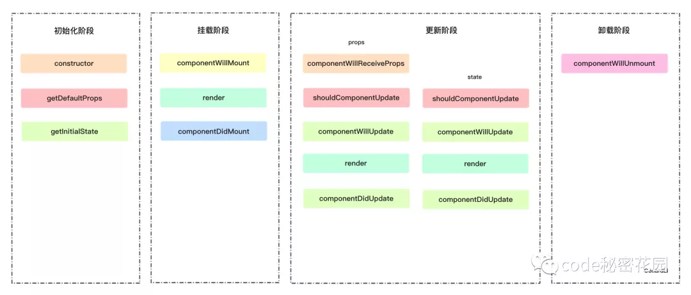

# React 生命周期

## 请给出下面render代码执行后控制台的字符串输出内容
```js
// 已知组件
class Base extends Component{
    constructor(props) {
        super(props);
        console.log(props.prefixer + ' constructor')
    }
    componentWillMount() { console.log(this.props.prefixer + ' will mount') }
    componentDidMount() { console.log(this.props.prefixer + ' did mount') }
    componentDidUpdate() { console.log(this.props.prefixer + ' did update') }
    render() { 
        console.log(this.props.prefixer + ' render')
        return this.props.children || null;
     }
}
 
 
// 渲染调用
render(<Base prefixer="parent">
    <Base prefixer="child" />
</Base>, document.querySelector('#root'))
```

答案：
```
parent constructor
parent will mount
parent render
child constructor
child will mount
child render
child did mount
parent did mount
```

## React生命周期有哪些，16版本生命周期发生了哪些变化
15生命周期：


16生命周期：


- React16新的生命周期弃用了3个钩子函数： `componentWillMount`、`componentWillUpdate`、`componentWillReceiveProps`；
- 新增了 `getDerivedStateFromProps`、`getSnapshotBeforeUpdate`来代替弃用的三个钩子函数（React16并没有删除这三个钩子函数，但是不能和新增的钩子函数混用，React17将会删除这三个钩子函数）；
- 新增了错误处理阶段：`componentDidCatch`。

> 由于`Fiber在新版本中会支持异步渲染的特性`，而`componentWillMount`、`componentWillUpdate`、`componentWillReceiveProps`这3个生命周期钩子，在*异步渲染模式下会有一些潜在的问题*，因此被弃用。

## componentWillUnmount有什么用，列举使用场景
ComponentWillUnmount()在组件被卸载和销毁之前立即调用。在此方法中执行任何必要的清理：
- 移除定时器和事件；
- 取消还未返回的网络请求回调（即网页发出请求,在请求数据还未回来的时候,跳到另一页面,数据回来之后会setstate,这样会导致内存泄露）。


#### 参考链接
[React生命周期有哪些，16版本生命周期发生了哪些变化](https://juejin.im/post/5d89cbd26fb9a06b2005a597#heading-0)