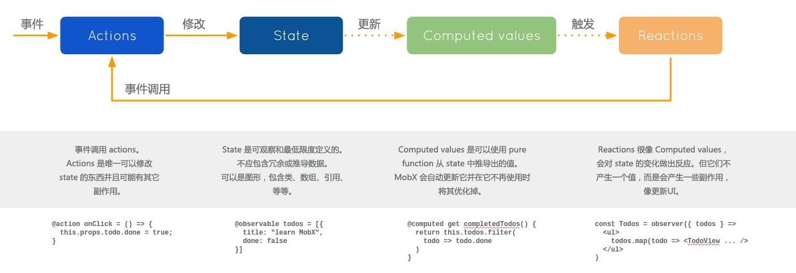

# mobx概述

## 如何工作
### mobx的流程

**事件触发**`action`，在`action`中**修改**`state` => 通过`computed`拿到**更新**的`state`的计算值 => **自动触发**对应的`reactions`（包含autorun，渲染视图，when，observer等）

### mobx的工作原理
mobx没有一个全局的状态树，状态分散在各个独立的store中。

通过`observable`装饰器**装饰**一个属性，使用`Object.defineProperty`来**拦截**对数据的访问，一旦值发生变化，将会调用`react的render`方法来实现**重新渲染视图**的功能或者**触发autorun**等。

### 使用

#### 示例1
::: details 使用示例
```js
import * as React from 'react';
import { observable, action, autorun, when, computed } from 'mobx';
import { observer } from 'mobx-react';

@observer
export default class Item extends React.Component {
    disposer: () => void;

    @observable
    count: string = 'right';

    @action
    setCount = () => {
        this.count = this.count === 'right' ? 'wrong' : 'right';
    }

    cancelAutoRun = () => {
        if (this.disposer) {
            this.disposer();
        }
    }

    @computed
    get helloCount() {
        return `hello ${this.count}`;
    }

    render() {
        return(
            <div>
            <h3>{this.count}</h3>
            <h4>{this.helloCount}</h4>
            <button onClick={this.setCount}>click</button>
            <button onClick={this.cancelAutoRun}>cancel</button>
            </div>);
    }

    componentDidMount() {
        this.disposer = autorun(() => {
            console.log(this.count);
        });

        when(
            () => this.count === 'wrong',
            () => console.log(this.count)
        );
    }
}
```
:::

- `@observable`：通过observable装饰器装饰一个属性，这个属性变动之后，就会自动触发响应的动作，这里的属性可以是string，boolean，array，object等；
- `reactions`：
    - autorun，when，observer都是reactions，当observable装饰的可观察属性发生变化时，会触发它们自动执行；
- `@observer`：observer的作用是，当可观察属性发生变化时，调用react组件的render方法重新渲染视图；
- `@autorun`：当autorun函数中依赖的可观察属性发生变化时，就会自动触发autorun函数的执行，同时，autorun函数返回一个函数，调用该函数将会在执行期间清理 autorun；
- `when`：该函数接受两个函数作为参数，第一个函数返回一个判断条件；在该判断条件满足时，将会执行第二个函数；when函数只会执行一次；
- `@computed`：computed的行为跟vue中的computed行为一直，它与autorun的区别简单的说，computed需要被使用才会触发自动计算，被使用可以是在视图中渲染这个值，也可以是其他reactions

#### 示例2
::: details 使用示例
```js
import * as React from 'react';
import { observable, intercept, observe } from 'mobx';
import { observer } from 'mobx-react';
import { ChangeEvent } from 'react';

@observer
export default class Item extends React.Component {

    @observable
    apple = {
        name: 'apple'
    };

    disposer1: () => void;

    disposer2: () => void;

    handleInput = (event: ChangeEvent<HTMLInputElement>) => {
        this.apple.name = event.target.value;
    }

    render() {
        return (
            <div>
                <h3>{this.apple.name}</h3>
                <input type="text" onChange={this.handleInput}/>
                </div>
        );
    }
    componentDidMount() {
        this.disposer1 = intercept(this.apple, 'name', (change) => {
            if (change.newValue === 'hello') {
                this.disposer1();
            }
            change.newValue = 'hi' + change.newValue;
            return change;
        });

        this.disposer2 = observe(this.apple, 'name', (change) => {
            console.log(change.newValue);
            console.log(change.oldValue);
        });
    }
}
```
:::

- `observe`/`intercept`都能拦截变化值(注意这里是`observe`，不是`observer`)
- 他们都会返回一个函数，执行函数将会清理掉对应的`observe`或者`intercept`
- `intercept`会在`observe`之前执行，可以在`intercept`中对可观察的值进行修改，修改后的值会反映到视图中去，也可以返回null，那么对应值的修改将不会触发对应的reactions
- `observe`中不能修改可观察的值，对应的回调函数中能够拿到oldValue和newValue，使用方法跟vue中的watch类似

#### 示例3
::: details 使用示例
```js
// apple.ts
import { action, observable } from 'mobx';

class Apple {
    @observable
    name: string = '';

    @action
    async setName(value: string) {
        const result = await new Promise((resolve) => {
            setTimeout(() => {
                resolve(value);
            }, 4000);
        });
        this.name = result as string;
    }
}
export default new Apple();


//Five.tsx

import * as React from 'react';
import { observer } from 'mobx-react';
import apple from './apple';

@observer
export default class Five extends React.Component {
    apple = apple;

    setName = () => {
        this.apple.setName('hello world');
    }
    render() {
        return (
            <div>
            {this.apple.name}
            <button onClick={this.setName}>change</button>
        </div>);
    }
}
```
:::
- 处理异步：mobx中直接使用`async/await`来优雅的处理异步的逻辑，相较于redux中使用middleware来处理异步的方式来说简单了很多；
- 管理各种数据流：mobx中推荐使用`单例模式`来管理各种数据流，就像上面的Apple类，封装了可观察值的属性以及对应的操作逻辑，然后new一个实例并导出；
- 在react中使用mobx，可以不需要操作state或props，直接赋值给类的属性即可；


#### 示例4
::: details 使用示例
```js
import * as React from 'react';
import { inject, observer, Provider } from 'mobx-react';
import { observable } from 'mobx';
import { ChangeEvent } from 'react';

interface CommonProps {
}

interface ContextProps extends CommonProps {
    color: string;
}

@inject('color')
class Message extends React.Component<CommonProps> {
    get  contextProps() {
        return this.props as ContextProps;
    }
    render() {
        return (
            <div>{this.contextProps.color}</div>
        );
    }
}

const MessageWrap => <Message/>;

@observer
export default class Container extends React.Component {
    @observable
    color: string = 'red';

    changeColor = (event: ChangeEvent<HTMLInputElement>) => {
        this.color = String(event.target.value) as string;
    }
    render() {
        return (
            <Provider color={this.color}>
                <div className="name">
                    <MessageWrap/>
                    <input onChange={this.changeColor}/>
                </div>
            </Provider>
        );
    }
}
```
:::
- 使用了mobx中的`Provider`和`inject`，其利用了react中的`context API`，能够实现**跨组件传递数据**的功能，其中的Message组件中有一个contextProps属性。


## redux和mobx的对比

1. mobx将数据保存在`分散的多个store中`；redux将数据保存在单一的store中；
2. mobx使用observable保存数据，数据变化后`自动处理响应的操作`；redux使用plain object保存数据，需要手动处理变化后的操作；
3. mobx中的`状态是可变的`，可以直接对其进行修改；redux使用不可变状态，这意味着状态是只读的，不能直接去修改它，而是应该返回一个新的状态，同时使用纯函数；
4. mobx相对来说比较简单，在其中有很多的抽象，mobx更多的`使用面向对象的编程思维`；redux会比较复杂，因为其中的函数式编程思想掌握起来不是那么容易，同时需要借助一系列的中间件来处理异步和副作用
5. mobx中`有更多的抽象和封装，调试会比较困难`，同时结果也难以预测；而redux提供能够进行时间回溯的开发工具，同时其纯函数以及更少的抽象，让调试变得更加的容易

通常会有结论说：对于一些简单的，规模不大的应用来说，用mobx就足够了。
