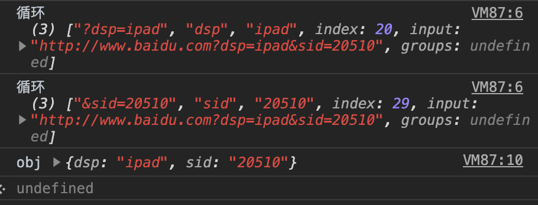

# 正则表达式基础

## 实例化正则对象
```js
// 字面量方式
var reg = /\d/g;

// 使用构造函数
var reg = new RegExp('\\d', 'g');
```
- **字面量方式**：把要写的正则放在两个//之间，其中//最后面的g是*高级搜索标志*。
- **使用构造函数**：通过new一个RegExp，接受两个字符串参数。第一个是正则的内容，在\d前面加上了一个\是对\d中的\进行`转义（escaping）`，记住这个是必须的，有特殊的字符都需要转义。第二个参数是*高级搜索标志*。

## Escaping转义

如果需要使用`任何特殊字符`的字面值（例如，搜索字符'*'），你必须通过在它前面放一个`反斜杠来转义`它。

## 元字符

有特殊含义的非字母字符。

### 直接量 元字符

- **\f**     换页符。
- **\n**     换行符。
- **\r**     回车符。
- **\t**     制表符。
- **\v**     垂直制表符。
- **\0**     匹配Null字符。
- **\/**     一个/直接量。
- **\\**     一个\直接量。
- **\.**     一个.直接量。
- **\***     一个*直接量。
- **\+**     一个+直接量。
- **\?**     一个?直接量。
- **\|**     一个|直接量。
- **\(**     一个(直接量。
- **\{**     一个{直接量。
- **\[**     一个[直接量。

### 匹配类 元字符

- **[]**    匹配类，匹配的时候匹配到[]其中一个即可：[0-9]表示0到9，[a-zA-Z]表示匹配所有的大小写字母。
- **^** 反向类：[^9]表示除9之外的所有字符。

### 预定义类 元字符

- **.**   表示除换行符(\n、\r也包括回车符)之外的任何单个字符，等价于 [^\r\n]。
- **d**   表示数字字符，等价于[0-9]。
- **D**   表示非数字字符，等价于[^0-9]。
- **s**   表示空白字符，等价于[\t\n\x\f\r]。
- **S**   表示空白字符，等价于[^\t\n\x\f\r]。
- **w**   表示单词字符(字母数字下划线)，等价于[a-zA-Z_0-9]。
- **W**   表示单词字符(字母数字下划线)，等价于[^a-zA-Z_0-9]。

### 边界类 元字符

- **^...**  表示以...开始。
- **...$**  表示以...结束。
- **\b**    表示单词边界。
- **\B**    表示非单词边界。

### 量词 元字符

- **?** 匹配前面一个表达式 0 次或者 1 次。等价于 {0,1}。作为量词时有两种模式：
    - 默认是`贪婪模式（匹配尽可能多的字符）`：/e?le?/ 匹配 "angel" 中的 'el'、"angle" 中的 'le' 以及 "oslo' 中的 'l'。
    - 如果**紧跟在任何量词 *、 +、? 或 {} 的后面**，将会使量词变为`非贪婪模式（匹配尽量少的字符）`：例如，对 "123abc" 使用 /\d+/ 将会匹配 "123"，而使用 /\d+?/ 则只会匹配到 "1"。
- **+** 匹配前面一个表达式 1 次或者多次。等价于 {1,}。
- **\***    匹配前一个表达式 0 次或多次。等价于 {0,}。
- {n} 表示出现n次。
- {n,m} 表示出现n到m次。
- {n,} 表示至少出现n次。

### 分组 元字符

- **(x)**   括号被称为`捕获括号`：会匹配 x 并且记住匹配项。记住的匹配项有可以使用在两种环节中：
    - \1、\2、...、\n 是用在正则表达式的`匹配环节`。
        - 模式 `/(foo) (bar) \1 \2/`，可匹配"foo bar foo bar"。模式中的 \1 和 \2 表示被捕获括号匹配的子字符串，即 foo 和 bar。
    - $1、$2、...、$n 是用在正则表达式的`替换环节`。
        - 模式`'John Smith'.replace(/(\w+)\s(\w+)/, "$2, $1")`可输出"Smith, John"。模式中的 $1 和 $2 表示被捕获括号匹配的子字符串，即 John 和 Smith，之后重新排列。
- **(?:x)** 这种括号叫作`非捕获括号`：匹配 x 但是不记住该匹配项。
- x|y 匹配 x 或者 y 。
- **x(?=y)**    `先行断言`：匹配 x 仅仅当 x 后面跟着 y 。
    - 例如，/Jack(?=Sprat)/会匹配到'Jack'仅仅当它后面跟着'Sprat'。/Jack(?=Sprat|Frost)/匹配'Jack'仅仅当它后面跟着'Sprat'或者是'Frost'。但是'Sprat'和'Frost'都不是匹配结果的一部分。
- **(?<=y)x**   `后行断言`：匹配 x 仅仅当 x 前面是 y 。
    - 例如，/(?<=Jack)Sprat/会匹配到'Sprat'仅仅当它前面是'Jack'。/(?<=Jack|Tom)Sprat/匹配'Sprat'仅仅当它前面是'Jack'或者是'Tom'。但是'Jack'和'Tom'都不是匹配结果的一部分。
- **x(?!y)**    `正向否定查找`：仅仅当 x 后面不跟着 y 时匹配 x 。
    - 例如，仅仅当这个数字后面没有跟小数点的时候，/\d+(?!\.)/ 匹配一个数字。正则表达式/\d+(?!\.)/.exec("3.141")匹配‘141’而不是‘3.141’
- **(?<!y)x**   `反向否定查找`：仅仅当 x 前面不是 y 时匹配 x 。

::: tip RegExp.$1 哪来的值
`RegExp` 是javascript中的一个内置对象。为正则表达式。

`RegExp.$1`是RegExp的一个属性，指的是与正则表达式匹配的第一个 子匹配(以括号为标志)字符串，以此类推，RegExp.$2，RegExp.$3，..RegExp.$99总共可以有99个匹配。

如果直接在控制台打印RegExp, 出现的一定是一个空字符串。那么, 我们在什么时候可以使用`RegExp.$1`呢?

其实**RegExp这个对象会在我们`调用了正则表达式的方法后`, 自动将最近一次的结果保存在里面**, 所以如果我们在使用正则表达式时, 有用到分组, 那么就可以直接在调用完以后直接使用RegExp.$xx来使用捕获到的分组内容, 如下:
```js
const r = /^(\d{4})-(\d{1,2})-(\d{1,2})$/
r.exec('2019-10-08')
 
console.log(RegExp.$1)  // 2019
console.log(RegExp.$2)  // 10
```
:::

## 高级搜索标志

- g	全局搜索。
- i	不区分大小写搜索。
- m	多行搜索。

## 正则相关方法汇总

正则表达式可以被用于 RegExp 的 exec 和 test 方法，以及 String 的 match、replace、search 和 split 方法。

### RegExp方法

- **exec**	一个在字符串中执行查找匹配的RegExp方法，它返回一个数组（未匹配到则返回 null）。
- **test**	一个在字符串中测试是否匹配的RegExp方法，它返回 true 或 false。

#### 匹配手机号
```js
/^1[34578]\d{9}&/.text(num)
```

#### 匹配邮箱

匹配邮箱规则很复杂，实际的生产中只需要满足基本的验证规则：姑且把邮箱地址分成“第一部分@第二部分”这样：
    - 第一部分：由字母、数字、下划线、英语句号（.）组成，
    - 第二部分：为一个域名，域名由字母、数字、短横线（-）、英语句号（.）、域名后缀组成，而顶级域名后缀一般为2-6位字母，如cn,com,net。
```js
/^[0-9A-Z_\.]+@[0-9A-Z-]+\.[A-Z]{2,6}$/i.test(str);
```

#### 用exec从url中截取信息
```js
var url = 'http://www.baidu.com?dsp=ipad&sid=20510';
var reg = /[?&](\w+)=(\w+)/g;
var obj = {};

while(ret = reg.exec(url)) {
    console.log('循环', ret);
    obj[ret[1]] = ret[2];
}

console.log('obj', obj);
```

使用.exec方法，当其匹配到reg，会逐次返回匹配值数组：


### String方法

- **match** 一个在字符串中执行查找匹配的String方法，它返回一个数组，在未匹配到时会返回 null。
- **search**    一个在字符串中测试匹配的String方法，它返回匹配到的位置索引，或者在失败时返回-1。
- **replace**   一个在字符串中执行查找匹配的String方法，并且使用替换字符串替换掉匹配到的子字符串。
- **split** 一个使用正则表达式或者一个固定字符串分隔一个字符串，并将分隔后的子字符串存储到数组中的 String 方法。

