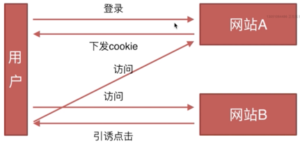

# 前端常见安全问题

## CSRF 跨站请求伪造
CSRF，跨站请求伪造，Cross-site request forgery

### 攻击原理
首先用户要登录网站A，网站A就会下发给用户cookie信息，当用户再访问网站B时，用户会被引诱点击网站B上的攻击链接，指向网站A的某个漏洞接口(常常是get类型)，点击后浏览器会上传用户的cookie，网站A会判定其为合法用户从而通过登录。

### 防御措施：
- token验证(除了下发cookie还要分配一个token，攻击链接只能携带cookie但不能携带token)
- referer验证(服务器判断页面的来源从而屏蔽攻击)
- 隐藏令牌(与token验证类似，只是字段不会放在链接上，如放在http header头中，较隐蔽)

## XSS 跨站脚本攻击
XSS，跨站脚本攻击，Cross-site scripting

### 攻击原理
向页面中注入js脚本，运行函数体来完成自己攻击网站的目的，可能导致cookie泄露

### 防御措施
核心点就是`过滤阻止插入的js脚本执行`。

## CSRF与XSS的区别
- `CSRF依赖于用户登录网站，利用网站的漏洞接口完成攻击`；
- `XSS则是向页面注入js脚本来执行函数体`。

**注意**：顺便提下sql注入，原理就是通过吧sql命令插入到web表单提交；或输入域名；或页面请求的查询字符串中，达到欺骗服务器执行恶意的sql命令。

- [前端安全面试题](https://www.cxymsg.com/guide/security.html#%E6%9C%89%E5%93%AA%E4%BA%9B%E5%8F%AF%E8%83%BD%E5%BC%95%E8%B5%B7%E5%89%8D%E7%AB%AF%E5%AE%89%E5%85%A8%E7%9A%84%E7%9A%84%E9%97%AE%E9%A2%98)

