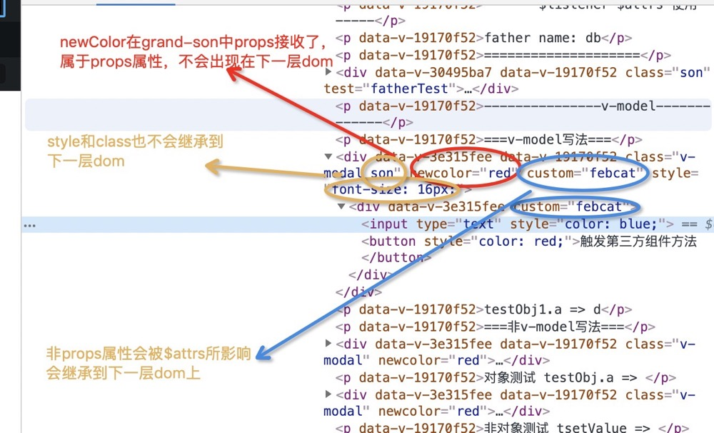

# $listeners & $attrs

## $listeners
::: tip
包含了父作用域中的 (不含 .native 修饰器的) v-on 事件监听器。它可以通过 v-on="$listeners" 传入内部组件——在创建更高层次的组件时非常有用。
:::

### **用来实现跨组件双向绑定(以封装第三方组件为例)**

***不使用$listeners***
::: tip
实现双向绑定时，只能通过绑定计算属性，通过计算属性的**set** 来主动触发this.$emit
:::

<br/>

**如下有一组例子：**

第三方组件**v-input**，简单的输入框v-model。**v-transfrom-input**是我们对其

进行二次封装的组件，再供给页面中使用。这些逻辑都一块写在listeners.vue中。

<br/>

**第三方组件：v-input**
```js
Vue.component("v-input", {
    props: {
        value: String
    },
    // 如下是v-model=“value”语法糖的拆解
    template: `
        <div>
            <input
                :style="color"
                type="text"
                :bind="value"
                v-on:input="$emit('input', $event.target.value)"
            >
        </div>
    `
});
```

<br/>

**封装第三方组件：v-transform-input**

想实现双向绑定值传递，需要绑定一个计算属性thisValue, 通过计算属性set来主动触发this.$emit('input')，实现上层父组件中v-model绑定值的更新。

主动触发是因为当前组件为**非表单控件**，并没有用户输入事件来主动触发更行上层input方法，所以要添加逻辑来主动进行触发。
```js
Vue.component("v-transform-input", {
    props: {
        value: String
    },
    computed: {
        thisValue: {
            get() {
                return this.value;
            },
            set(value) {
                this.$emit("input", value); // 主动触发上层父子间更改数据
            }
        }
    },
    template: ` <v-input v-model="thisValue"></v-input>`
});
```

<br/>

**listeners.vue使用封装好的组件**
```js
// template
<v-transform-inpu v-model="value"></v-transform-inpu>
// js
data() {
    return {
        value: ''
    }
}
```

<br/>

***使用$listeners***
::: tip
利用listeners将父组件作用域绑定的方法绑定此组件作用域的特点。
:::

因为$listeners将父组件上v-model绑定值的input方法都绑定到了v-transform中，所以第三方组件v-input

中触发this.$emit('input')就能在v-transform中找到$listeners绑定来的input方法，这个input方法其实就

是最顶层v-model指令语法糖的默认input方法，更新的也是最顶层的那个value

**封装第三方组件**
```js
Vue.component("v-transform-input", {
    props: {
        value: String
    },
    template: `
        <v-input :value="value" v-on="$listeners">
        </v-input>
    `
});
```

### **用来实现跨组件调用方法(以封装第三方组件为例)**

***在没有使用$listeners时***
::: tip
调用第三方组件提供的方法需要逐层添加事件绑定，来调用$emit
:::

<br/>

同样的组件：第三方组件**v-input**，提供一个setColor方法改变按钮的字体颜色，供上层组件调用，

然后我们对其进行二次封装的**v-transfrom-input**，再供给页面中使用

**第三方组件：v-input**
```js
Vue.component("v-input", {
    props: {
        value: String
    },
    data() {
        return {
            color: 'color: red'
        }
    },
    methods: {
        setColor() {
            this.color = 'color: green';
            this.$emit('otherMethod', 'green');
        }
    },
    template: `
        <div>
            <input
                :style="color"
                type="text"
                v-model="value"
            >
            <button @click="setColor">触发第三方组件方法</button>
        </div>
    `
});
```

**封装第三方组件：v-transfrom-input**

```js
Vue.component("v-transform-input", {
    methods: {
        otherMethod(color) {
            // 通过传统的$emit父子组件方法来调用
            this.$emit('otherMethod', color);
        }
    }
    template: `<v-input @otherMethod="otherMethod"></v-input>`
});
```

**使用封装好的组件: listeners.vue**
```js
// template
<v-transform-inpu @otherMethod="otherMethod"></v-transform-inpu>
// js
methods: {
    otherMethod(color) {
        console.log('第三方组件触发', color);
    }
}
```

<br/>

***使用$listeners***
::: tip
同样利用listeners将父组件作用域绑定的方法绑定此组件作用域的特点。
:::
上层父组件的otherMethod方法也合并到了当前组件v-transfrom-input的作用域中，v-inputsetColr中调

用this.$emit('otherMethod'), 也就能在v-transfrom-input上找到对应方法。

**改写封装的第三方组件**
```js
Vue.component("v-transform-input", {
    template: `
        <v-input v-on="$listeners">
        </v-input>
    `
});
```

### 当父组件双向绑定值没有初始化注册

还是那个例子，不做初始化双向绑定就会失效。可能在vue实例第一次渲染时候，没有遍历到这个值，就不会生成相应的obsever。
有待继续发掘。

**使用封装好的组件: listeners.vue**
```js
// template
<v-transform-inpu v-model="value" @otherMethod="otherMethod"></v-transform-inpu>
// js
data() {
    return {
        // value: '' // 这里不做初始化处理。
    }
},
methods: {
    otherMethod(color) {
        console.log('第三方组件触发', color);
    }
}
```

## $attrs
::: tip
包含了父作用域中不作为 prop 被识别 (且获取) 的特性绑定 (class 和 style 除外)。当一个组件没

有声明任何 prop 时，这里会包含所有父作用域的绑定 (class 和 style 除外)，并且可以通过

v-bind="$attrs" 传入内部组件——在创建高级别的组件时非常有用。
:::

### 使用

孙组件

```js
// template
<template>
    <p :style="getColor">我是孙组件</p>
</template>
// script
export default{
    // 如果在不在props中声明color 那么这个数据，请使用this.$arrts.color
    // 如果声明，那么this.$props上就会有color
    props: {
        newColor: String
    },
    computed: {
        getColor() {
            return `color: ${this.newColor || "green"}`;
        }
    }
}
```

子组件
```js
// template
<grand-son v-bind="$attrs"></grand-son>

// script
import GrandSon from './GrandSon';

export default {
    ...,
    components: {
        GrandSon
    }
}
<>
```

父组件

```js
// template
// style class 不会在$attrs上
<son newColor="red" custom="febcat" style="font-size: 16px;" class="son"></son>

// script
import Son from './Son';

export default {
    ...,
    components: {
        Son
    }
}

// css
.son{
    font-weight: 500;
}
```

查看dom如下



<br/>

### inheritAttrs禁用特性继承
+ 默认值为true

- 如果你不希望组件的根元素继承特性，你可以在组件的选项中设置 inheritAttrs: false

+ 不会影响 style 和 class 的绑定。


```js
Vue.component('my-component', {
  inheritAttrs: false,
  // ...
})
```

## 小结
**v-model表单控件**
+ 通常默认绑定value，数据更新方法为input
- checkbox, radio 使用为checked，更新方法为change
+ select 默认绑定value, 数据更新为change
---------
**v-model非表单控件作为中间层组件（如封装第三方组件)**
+ 未使用$listeners情况下需要通过v-model双向绑定计算属性，数据更新

  触发set方法，在set方法中进而主动触发this.$emit('input')
- 使用$listeners情况下，仅需配合$attrs就能达到目的，v-model也不必写
---------
**双向绑定值初始化**
+ 不管任何形式的值，只要在data中没有初始化，那么双向绑定就不会成功

<br/>
