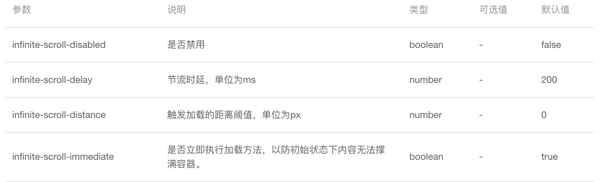
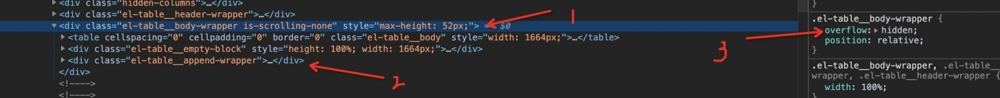
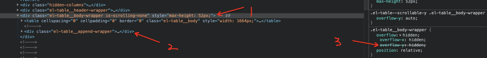

# 关于ElementUI的无限滚动

[传送门在此](https://element.eleme.cn/#/zh-CN/component/infiniteScroll)

## 概览
下面截取至官方文档的属性列表


官方的一个例子：
```html
<template>
  <ul class="infinite-list" v-infinite-scroll="load" style="overflow:auto">
    <li v-for="i in count" class="infinite-list-item">{{ i }}</li>
  </ul>
</template>

<script>
  export default {
    data () {
      return {
        count: 0
      }
    },
    methods: {
      load () {
        this.count += 2
      }
    }
  }
</script>
```
例子上吧`v-infinite-scroll`指令绑定再在了`ul`上面，并且设置了`style="overflow:auto"`。

## 探究源码
那么它是怎么实现无限滚动的呢？且看源码：

```javascript
// dom.js
export const isScroll = (el, vertical) => {
  if (isServer) return;

  const determinedDirection = vertical !== null || vertical !== undefined;
  const overflow = determinedDirection
    ? vertical
      ? getStyle(el, 'overflow-y')
      : getStyle(el, 'overflow-x')
    : getStyle(el, 'overflow');

  return overflow.match(/(scroll|auto)/);
};

export const getScrollContainer = (el, vertical) => {
  if (isServer) return;

  let parent = el;
  while (parent) {
    if ([window, document, document.documentElement].includes(parent)) {
      return window;
    }
    if (isScroll(parent, vertical)) {
      return parent;
    }
    parent = parent.parentNode;
  }

  return parent;
};

// infinite-scroll
export default {
  name: 'InfiniteScroll',
  inserted(el, binding, vnode) {
    const cb = binding.value;

    const vm = vnode.context;
    // only include vertical scroll
    const container = getScrollContainer(el, true);
    const { delay, immediate } = getScrollOptions(el, vm);
    const onScroll = throttle(delay, handleScroll.bind(el, cb));

    el[scope] = { el, vm, container, onScroll };

    if (container) {
      container.addEventListener('scroll', onScroll);

      if (immediate) {
        const observer = el[scope].observer = new MutationObserver(onScroll);
        observer.observe(container, { childList: true, subtree: true });
        onScroll();
      }
    }
  },
  unbind(el) {}
};
```
通过源码可以发现，它有一个寻找 scrollContainer （可滚动容器）的过程（上面的getScrollContainer函数），如果当前元素可滚动（上面的isScroll函数），则取当前元素否则一直向上找直到最顶端。

## 发现问题
对于一些简单的元素通过该指令可以轻松的实现无限滚动加载，但是`ElementUI`的`table`就不是那么老实了。
我们通过table提供的append插槽插入一个空标签，从而达到给table内部的可滚动容器绑定滚动事件的目的：

```html
<el-table
  max-height="100"
  :data="tableData"
  style="width: 100%">
  <el-table-column
    prop="date"
    label="日期"
    width="180">
  </el-table-column>
  <span slot="append"></span>
</el-table>
```
当没有数据时，看下dom结构和样式表：

有数据时，看下dom结构和样式表：

可以发现：

1. 不管有没有数据，`append`插槽都在（废话）。
1. 观察离`append`最近的祖级可滚动容器 1 ，以及它的样式 3 ，发现有数据且数据撑满了容器后 `overflow-y` 发生了改变，也就是说只有当容器无法显示更多内容时，`Element`将容器的样式设为了`overflow-y: auto;`

如此看来，要寻找一个合适的时机插入`append`才能准确的将`scroll`事件绑定到可滚动容器 1 上面。

## 解决问题
因此我们必须先手动将容器填满，然后才能将`append`插入进去。且看代码：

```html
<el-table
  max-height="100"
  :data="tableData"
  style="width: 100%">
  <el-table-column
    prop="date"
    label="日期"
    width="180">
  </el-table-column>
  <span
    v-if="showLoadMore"
    slot="append"
    v-infinite-scroll="load"
    infinite-scroll-immediate="false"
  ></span>
  <span v-if="noMore">没有更多了～</span>
</el-table>

<script>
  export default {
  	data() {
    	return {
      	inserted: false,
        tableData: []
      }
    },
    computed: {
    	showLoadMore() {
      	return this.inserted && !this.noMore
      },
      noMore() {}
    },
    mounted() {
    	this.getData()
    },
    method: {
    	async getData() {
      	this.tableData = await action()
        if (!this.inserted) {
        	this.$nextTick(() => {
          	this.inserted = true
          })
        }
      },
      load() {
      	if (!this.noMore) {
        	this.getData()
        }
      }
    }
  }
</script>
```
上面的代码，我们通过`v-if`去控制`append`插槽内容的插入时机，首次加载数据完成且`dom`已更新后将`inserted`设为`true`表示插入了，那么此时的内容已撑满容器，因此当 `v-infinite-scroll` 指令在向上寻找可滚动容器的时候立马就找到了`table`内部那个对应的可滚动容器并且将滚动事件绑定在该容器上。

## 总结
`v-infinite-scroll`有一个寻找 scrollContainer （可滚动容器）的过程（上面的getScrollContainer函数），如果当前元素可滚动（上面的isScroll函数），则取当前元素否则一直向上找直到最顶端。
注意：该指令是在该元素插入时就会开始寻找可滚动容器，也就是说如果滚动容器的出现是有条件的，那么就要考虑手动控制它何时开始寻找可滚动容器。
