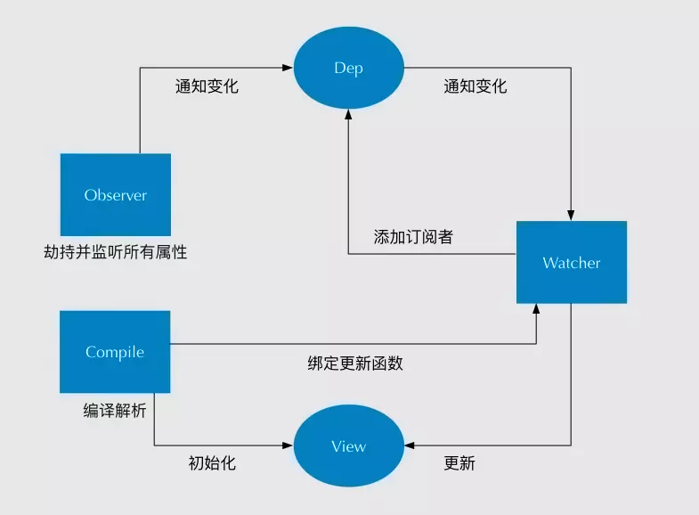

# Vue框架基础

比较熟悉vue的同学都很清楚，vue2.x在 new Vue() 之后。 Vue 会调用 _init 函数进行初始化，它会初始化生命周期、事件、 props、 methods、 data、 computed 与 watch 等。其中最重要的是通过 Object.defineProperty 设置 setter 与 getter 函数，用来实现「响应式」以及「依赖收集」。

## Vue响应式原理

### Vue的响应式系统
响应式系统简述:

任何一个 Vue Component 都有一个与之对应的 Watcher 实例。
Vue 的 data 上的属性会被添加 getter 和 setter 属性。
当 Vue Component render 函数被执行的时候，data 上会被 触碰(touch)，即被读，getter 方法会被调用，此时 Vue 会去记录此 Vue component 所依赖的所有 data。(这一过程被称为依赖收集)
data 被改动时（主要是用户操作），即被写，setter 方法会被调用，此时 Vue 会去通知所有依赖于此 data 的组件去调用他们的 render 函数进行更新。


### Vue2.x响应式数据原理
vue2.x中如何监测数组变化？  使用了函数劫持的方式，重写了数组的方法，Vue将data中的数组进行了原型链重写，指向了自己定义的数组原型方法。这样当调用数组api时，可以通知依赖更新。如果数组中包含着引用类型，会对数组中的引用类型再次递归遍历进行监控。这样就实现了监测数组变化。

### Vue3.x响应式数据原理
怎么解决Proxy只会代理对象的第一层？ Vue3 会 判断当前Reflect.get的返回值是否为Object，如果是则再通过reactive方法做代理， 这样就实现了深度观测。
监测数组的时候可能触发多次get/set，如何防止触发多次呢？  可以判断key是否为当前被代理对象target自身属性，也可以判断旧值与新值是否相等，只有满足以上两个条件之一时，才有可能执行trigger。

### Proxy与Object.defineProperty的优劣对比

Proxy的优势如下:
- Proxy可以直接监听对象而非属性
- Proxy可以直接监听数组的变化
- Proxy有多达13种拦截方法，不限于apply、ownKeys、deleteProperty、has等等是Object.defineProperty不具备的
- Proxy返回的是一个新对象，可以只操作新的对象达到目的，而Object.defineProperty只能遍历对象属性直接修改
- Proxy作为新标准将受到浏览器厂商重点持续的性能优化，也就是传说中的新标准的性能红利

Object.defineProperty的优势如下:
- 兼容性好，支持IE9

## 虚拟Dom比普通Dom性能更好吗？(虚拟DOM优劣势)

传送门：[虚拟Dom比普通Dom性能更好吗？(虚拟DOM优劣势)](../react/react-virtual-dom.html#虚拟dom比普通dom性能更好吗？-虚拟dom优劣势)

::: tip AST是VNode吗
- AST是指抽象语法树（abstract syntax tree），或者语法树（syntax tree），是源代码的抽象语法结构的树状表现形式。Vue在mount过程中，template会被编译成AST语法树。
- 然后，经过generate（将AST语法树转化成render function字符串的过程）得到render函数，返回VNode。即 `VNode是由渲染函数得出的真实DOM的抽象`。
:::

## 既然Vue通过数据劫持可以精准探测数据变化，为什么还需要虚拟DOM进行diff检测差异? 「pull、push」

现代前端框架有两种方式进行「变化侦测」，一种是pull，一种是push。
### pull
- `React` 的 setState 和（早期）Angular 的脏检查都是 `pull`：即 系统不知道数据是否已改变，需要进行 pull。
- 以React为例，用 setState API显式更新，然后React会进行一层层的 VDOM Diff操作找出差异，之后Patch到DOM上。也就是说，React从一开始就不知道到底是哪发生了变化，只是知道 “有变化了”，然后再进行比较暴力的Diff操作查找 “哪发生变化了”。

### push
- 相比之下 push 在数据变动时会立刻知道哪些数据改变，但这里还有个粒度问题。如果 pull 是完全粗粒度的，那么 push 可以进行更细粒度的更新。push 方式 要做到 粒度掌控，就需要付出 相应内存开销、建立依赖追踪开销的代价。
- 以`Vue`为例，当 Vue 初始化时，就会对数据data进行依赖收集，一但数据发生变化，响应式系统就会立刻知道 “在哪发生变化了”。而Vue的每一次数据绑定，就需要一个Watcher，如果粒度过细，就会有太多的Watcher，开销太大，但如果粒度过粗，又无法精准侦测变化。
- 因此，Vue 选择的是中间的 **「混合式：`push + pull`」**：Vue在`组件级别`选择 push方式，每个组件都是 Watcher，一旦某个组件发生变化Vue立刻就能知道；而在组件内部选择 pull方式，使用 VDOM Diff 进行比较。

## Vue为什么没有类似于React中shouldComponentUpdate的生命周期？
承接上文：
- 首先，React是以 pull 的方式侦测变化的，因为不能知道到底哪里发生了变化，所以会进行大量 VDOM Diff 差异检测，为了提升性能，就可以使用 SCU（shouldComponentUpdate）来避免对那些肯定不会变化的组件进行Diff检测。
- 而Vue在组件级是push方式，在push阶段能够自动判断，无需手动控制Diff。在组件内是pull的方式，理论上是可以引入类似于 SCU的钩子来让开发者控制的，但是，通常合理大小的组件不会有过量的Diff 检测，手动优化的价值有限。因此Vue没有引入SCU。


## 怎样理解Vue的单向数据流

同：[什么叫做react「单向数据流」？](/Question-Bank/react/react-other-points.html#什么叫做react「单向数据流」？)

prop只能向下传递，子组件不能改变prop（如果试图改变会报错），只能通过$emit派生事件给父组件修改。

有两种常见的试图改变一个 prop 的情形 :
- prop 用来传递一个初始值；这个子组件接下来希望将其作为一个本地的 prop 数据来使用。 在这种情况下，最好**定义一个本地的 data 属性并将这个 prop 用作其初始值**：
- prop 以一种原始的值传入且需要进行转换。 在这种情况下，最好使用这个 prop 的值来**定义一个计算属性**。

## Vue2.x组件通信有哪些方式

### 1、父子组件通信
- 父->子props，子->父 $on、$emit；
- ref 获取实例的方式调用组件的属性或者方法；
- 获取父子组件实例 $parent、$children，耦合性太强，不推荐使用；
- 使用 slot 插槽；

### 2、兄弟组件通信
- EventBus：通过EventBus（一个空的 Vue 实例作为中央事件中心）进行信息的发布与订阅，实现跨组件通信。（Vue.prototype.$bus = new Vue）
- Vuex
### 3、跨级组件通信
- Vuex：Vuex 是一个专为 Vue.js 应用程序开发的状态管理模式。“store”是一个容器，包含着应用中大部分的状态 ( state )。**Vuex与单纯的全局对象差别**在于：
    - Vuex 的状态存储是响应式的。当 Vue 组件从 store 中读取状态的时候，若 store 中的状态发生变化，那么相应的组件也会相应地得到高效更新。
    - 改变 store 中的状态的唯一途径就是显式地提交  (commit) mutation。这样使得我们可以方便地跟踪每一个状态的变化。
- Provide、inject：官方不推荐使用，但是写组件库时很常用。允许一个祖先组件向其所有子孙后代注入一个依赖，不论组件层次有多深。
- 通过根实例$root访问。
- $attrs、$listeners
    - $attrs：包含了父作用域中不被 prop 所识别 (且获取) 的特性绑定 ( class 和 style 除外 )。当一个组件没有声明任何 prop 时，这里会包含所有父作用域的绑定 ( class 和 style 除外 )，并且可以通过 v-bind="$attrs" 传入内部组件。通常配合 inheritAttrs 选项一起使用。
    - $listeners：包含了父作用域中的 (不含 .native 修饰器的) v-on 事件监听器。它可以通过 v-on="$listeners" 传入内部组件。
    
#### 非prop特性
*非prop特性: 一个非 prop 特性是指传向一个组件，但是该组件并没有相应 prop 定义的特性。*

这种特性的意思是：没有被定义为 prop 的特性会`以HTML特性形式`，自动添加到`组件的根元素上`，将已有的**同名特性进行替换**或**与其进行智能合并**：
- **替换/合并已有的特性**：这里的`以HTML特性形式`传到根元素，是当做dom属性传给根元素，并不是当做组件属性传给根元素的，即如果根组件是个封装组件，而不是原生标签的话，非props属性也只是当做普通dom属性传给根组件，想要当做组件属性传给根组件使用，还是要主动v-bind="$attrs"。
- **禁用特性继承**：`inheritAttrs: false` 是不影响class与style的，它与 **$attrs** 配合，你就禁用根组件继承，并可以v-bind到非根元素上了。

## nextTick 实现原理是什么？
在下次 DOM 更新循环结束后执行延迟回调，在修改数据之后立即使用 nextTick 来获取更新后的 DOM。nextTick主要使用了宏任务和微任务。根据执行环境分别尝试采用：

1. nextTick 默认会以 micro-task 的方式执行，优先检测是否支持 `Promise`；
2. 不支持的话，直接指向 macro-task，优先检测是否支持 `setImmediate`（高版本IE和Etage支持）；
3. 不支持的话，再去检测是否支持 micro-task 的 `MessageChannel`（因为兼容性，vue2.5开始抛弃了MutationObserver）；
4. 如果仍不支持，最终降级为 macro-task `setTimeout 0`；

默认的情况，会先以 micro task 方式执行，因为 micro task 可以在一次 tick 中全部执行完毕，在一些有重绘和动画的场景有更好的性能。

但是由于 micro task 优先级较高，在某些情况下，可能会在事件冒泡过程中触发，导致一些问题，所以有些地方会强制使用 macro task（如 v-on）。

**注意**：之所以将 nextTick 的回调函数放入到「数组队列」中一次性执行，而不是直接在 nextTick 中执行回调函数，是为了保证在同一个tick内多次执行了 nextTcik，不会开启多个异步任务，而是把这些异步任务都压成一个同步任务，在下一个tick内执行完毕。

*react 中没有nextTick，可以使用 setTimeout 0秒 代替。*

## Vue的生命周期
- **beforeCreate**：是new Vue()之后触发的第一个钩子，在当前阶段data、methods、computed以及watch上的数据和方法都不能被访问。
- **created**：在实例创建完成后发生，当前阶段已经完成了数据观测，也就是可以使用数据，更改数据，**在这里更改数据不会触发updated函数**。可以做一些初始数据的获取，**在当前阶段无法与Dom进行交互，如果非要想，可以通过vm.$nextTick来访问Dom**。
- **beforeMount**：发生在挂载之前，**在这之前template模板已导入渲染函数编译**。而当前阶段**虚拟Dom已经创建完成，即将开始渲染**。在此时也可以对数据进行更改，不会触发updated。
- **mounted**：在「编译好的模板挂载到页面上」完成后发生，在当前阶段，**真实的Dom挂载完毕**，**数据完成双向绑定**，可以访问到Dom节点，**使用$refs属性对Dom进行操作**。
- **beforeUpdate**：发生在更新之前，也就是响应式数据发生更新，**虚拟dom重新渲染之前被触发**，**你可以在当前阶段进行更改数据，不会造成重渲染**。
- **updated**：发生在更新完成之后，当前阶段**组件Dom已完成更新。要注意的是避免在此期间更改数据，因为这可能会导致无限循环的更新**。
- **beforeDestroy**：发生在实例销毁之前，在当前阶段**实例完全可以被使用**，我们可以在这时进行**善后收尾**工作，比如**清除计时器**。
- **destroyed**：发生在实例销毁之后，这个时候只剩下了dom空壳。组件已被拆解，数据绑定被卸除，监听被移出，子实例也统统被销毁。
- *activited*：keep-alive 专属，组件被激活时调用。
- *deactivated*：keep-alive 专属，组件被销毁时调用。

#### this.$refs为什么会是undefined
父组件可以通过this.$refs.xx.fn调用子组件里的函数，但是有时会出现 fn 未定义的情况，这是为什么呢？

`$refs` 只会在组件`渲染完成之后生效`，并且它们`不是响应式的`。这仅作为一个用于直接操作子组件的“逃生舱”——你**应该避免在模板或计算属性中访问** `$refs`。

**解决办法**：
1. 如果你在mounted里获取this.$refs，因为dom还未完全加载，所以你是拿不到的，update阶段则是完成了数据更新到 DOM 的阶段(对加载回来的数据进行处理)，此时，就可以使用this.$refs了。
2、如果写在method中，那么可以使用 this.$nextTick(() => {}) 等页面渲染好再调用，这样就可以了。


## Vue中父子组件生命周期执行顺序

- 加载渲染过程
    - `父beforeCreate->父created->父beforeMount->子beforeCreate->子created->子beforeMount->子mounted->父mounted`
- 父子组件更新过程（相互有影响时）
    - `父beforeUpdate->子beforeUpdate->子updated->父updated`
- 父子组件更新过程（相互无影响）
    - `自身beforeUpdate -> 自身updated`
- 销毁过程
    - `父beforeDestroy->子beforeDestroy->子destroyed->父destroyed`

## 接口请求一般放在哪个生命周期中？
可以在钩子函数 created、beforeMount、mounted 中进行调用，因为在这三个钩子函数中，data 已经创建，可以将服务端端返回的数据进行赋值。

推荐在 `created` 钩子函数中调用异步请求，因为在 created 钩子函数中调用异步请求有以下优点：
- 能更快获取到服务端数据，减少页面 loading 时间；
- ssr 不支持 beforeMount 、mounted 钩子函数，所以放在 created 中有助于一致性；


## Vue父组件如何监听子组件的生命周期
可以手动通过 $emit 触发父组件的事件，但更简单的方式可以在父组件引用子组件时通过`@hook`来监听：
```js
//  Parent.vue
<Child @hook:mounted="doSomething" ></Child>

doSomething() {
   console.log('父组件监听到 mounted 钩子函数 ...');
},
    
//  Child.vue
mounted(){
   console.log('子组件触发 mounted 钩子函数 ...');
},

// 以上输出顺序为：
// 子组件触发 mounted 钩子函数 ...
// 父组件监听到 mounted 钩子函数 ...     
```  
`@hook`不仅可以监听 mounted，其它的生命周期事件，例如：created，updated 等都可以监听。


## Computed 和 Watch
### Computed
- 本质是一个具备缓存的watcher，依赖的属性发生变化就会更新视图。
- 适用于计算比较消耗性能的计算场景。当表达式过于复杂时，在模板中放入过多逻辑会让模板难以维护，可以将复杂的逻辑放入计算属性中处理。
### Watch
- 没有缓存性，更多的是观察的作用，可以监听某些数据执行回调。
- 当我们需要**深度监听对象中的属性**时，可以打开`deep：true`选项，这样便会对对象中的每一项进行监听。这样会带来性能问题，优化的话可以使用字符串形式监听。
    - watch不但可以监听键路径，还可以监听一个未被定义的计算属性(即定义一个函数来监听)，vm.$watch会返回一个unwatch函数，用来停止触发回调。

## v-if和v-show的区别
- `v-if` 是真正的条件渲染，会控制真实DOM元素的销毁和重建。
- `v-show` 的元素`始终会被渲染`，只是简单地切换元素的 CSS 属性 `display`。如果条件不成立，元素`display: none`（在Dom tree中，但因为不在Css tree中，所以也就不在render tree中），右键检查元素的话也是有Dom元素结构的，因为在Dom tree中。

传送门：结合 [display: none与 visibility: hidden]() 一起理解。

## 组件中的data为什么是一个函数？
一个组件被复用多次的话，也就会创建多个实例。本质上，`这些实例用的都是同一个构造函数`。如果data是对象的话，对象属于引用类型，会影响到所有的实例。所以为了保证组件不同的实例之间data不冲突，data必须是一个函数。


## v-model的原理
v-model本质就是一个语法糖，可以看成是`value + input`方法的`语法糖`。 可以通过**model属性**的**prop和event**属性来进行自定义。原生的v-model，会根据标签的不同生成不同的事件和属性。  

## Vue事件绑定原理说一下
原生事件绑定是通过addEventListener绑定给真实元素的，组件事件绑定是通过Vue自定义的$on实现的。

## Vue模版编译原理（compiler）?
简单说，Vue complier 是将 template 转化成一个 render 字符串。会经历以下阶段：

1. **parse过程（生成AST树）**：
    - 首先解析模版，生成`AST语法树`(一种用JavaScript对象的形式来描述整个模板)。使用`大量的正则表达式对模板进行解析`，遇到标签、文本的时候都会执行对应的钩子进行相关处理。
2. **optimize过程（优化，标记静态节点diff跳过）**：
    - Vue的数据是响应式的，但`其实模板中并不是所有的数据都是响应式的`。有一些数据首次渲染后就不会再变化，对应的DOM也不会变化。那么优化过程就是`深度遍历AST树`，按照相关条件对树节点进行标记。这些`被标记的节点(静态节点)`我们就可以`跳过对它们的比对`，对运行时的模板起到很大的优化作用。
3. **generate过程（生成render字符串）**：
    - 编译的最后一步是`将优化后的AST树转换为可执行的代码，即render函数`（而render函数会返回VNode）。

## Vue双向绑定原理实现
View 变化更新 Data ，可以通过事件监听的方式来实现，所以 Vue 的数据双向绑定的工作主要是如何根据 Data 变化更新 View（4 个步骤）：
1. 实现一个监听器 Observer：对数据对象进行遍历，包括子属性对象的属性，利用 Object.defineProperty() 对属性都加上 setter 和 getter。这样的话，给这个对象的某个值赋值，就会触发 setter，那么就能监听到了数据变化。
2. 实现一个解析器 Compile：解析 Vue 模板指令，将模板中的变量都替换成数据，然后初始化渲染页面视图，并将每个指令对应的节点绑定更新函数，添加监听数据的订阅者，一旦数据有变动，收到通知，调用更新函数进行数据更新。
3. 实现一个订阅者 Watcher：Watcher 订阅者是 Observer 和 Compile 之间通信的桥梁 ，主要的任务是订阅 Observer 中的属性值变化的消息，当收到属性值变化的消息时，触发解析器 Compile 中对应的更新函数。
4. 实现一个订阅器 Dep：订阅器采用 发布-订阅 设计模式，用来收集订阅者 Watcher，对监听器 Observer 和 订阅者 Watcher 进行统一管理。


## Vue2.x和Vue3.x渲染器的diff算法:
简单来说，diff算法有以下过程

- 同级比较，再比较子节点
- 先判断一方有子节点一方没有子节点的情况(如果新的children没有子节点，将旧的子节点移除)
- 比较都有子节点的情况(核心diff)
- 递归比较子节点

正常Diff两个树的时间复杂度是`O(n^3)`，但实际情况下我们`很少会进行跨层级的移动DOM`，所以Vue将Diff进行了优化，从`O(n^3) -> O(n)`，只有当新旧children都为多个子节点时才需要用核心的Diff算法进行同层级比较。
Vue2的核心Diff算法采用了`双端比较`的算法，同时从新旧children的两端开始进行比较，借助key值找到可复用的节点，再进行相关操作。相比React的Diff算法，同样情况下可以减少移动节点次数，减少不必要的性能损耗，更加的优雅。
Vue3.x借鉴了 ivi算法和 inferno算法，在创建VNode时就确定其类型，以及在`mount/patch`的过程中采用`位运算`来判断一个VNode的类型，在这个基础之上再配合核心的Diff算法，使得性能上较Vue2.x有了提升。该算法中还运用了`动态规划`的思想求解最长递归子序列。

::: details
比较只会在同层级进行, 不会跨层级比较，复杂度为O(n)。
如果不值得比较时，新节点直接把老节点整个替换了；如果值得比较会执行patchVnode(oldVnode, vnode)，diff的核心实现主要通过两个方法，patchVnode 与 updateChildren 。
patchVnode 有两个参数，分别是老节点 oldVnode, 新节点 vnode 。主要分五种比较情况：
- if (oldVnode === vnode)，他们的引用一致，可以认为没有变化。
- if(oldVnode.text !== null && vnode.text !== null && oldVnode.text !== vnode.text)，文本节点的比较，需要修改，则会调用Node.textContent = vnode.text。
- if( oldCh && ch && oldCh !== ch ), 两个节点都有子节点，而且它们不一样，这样我们会调用 updateChildren 函数比较子节点，这是diff的核心，后边会讲到。
- if (ch)，只有新的节点有子节点，调用createEle(vnode)，vnode.el已经引用了老的dom节点，createEle函数会在老dom节点上添加子节点。
- if (oldCh)，新节点没有子节点，老节点有子节点，直接删除老节点。
updateChildren 是关键，这个过程可以概括如下：

oldCh 和 newCh 各有两个头尾的变量 StartIdx 和 EndIdx ，它们的2个变量相互比较，一共有4种比较方式。如果 4 种比较都没匹配，如果设置了key，就会用key进行比较，在比较的过程中，变量会往中间靠，一旦 StartIdx > EndIdx 表明 oldCh 和 newCh 至少有一个已经遍历完了，就会结束比较。
:::

## Vue中的key到底有什么用
key是为Vue中的vnode唯一标记id，通过这个key，diff操作可以更准确、更快速。

- **准确**: **如果不加key，那么vue会选择复用节点**(Vue的`就地更新策略`)，导致之前节点的状态被保留下来，会产生一系列的bug.
- **快速**: key的唯一性可以被Map数据结构充分利用，相比于遍历查找的时间复杂度`O(n)`，Map的时间复杂度仅仅为`O(1)`.

## 虚拟Dom以及key属性的作用
（首先明白：使用document.CreateElement 和 document.CreateTextNode创建的就是真实节点）由于在浏览器中操作DOM是很昂贵的。频繁的操作DOM，会产生一定的性能问题。这就是虚拟Dom的产生原因。

Virtual DOM本质就是用一个原生的JS对象去描述一个DOM节点。是对真实DOM的一层抽象。

VirtualDOM映射到真实DOM要经历VNode的create、diff、patch等阶段。

**「key的作用是尽可能的复用 DOM 元素。」**：新旧 children 中的节点只有顺序是不同的时候，「最佳实践」应该是通过移动元素的位置来达到更新的目的。因此，需要在新旧 children 的节点中保存映射关系，以便能够在旧 children 的节点中找到可复用的节点。key也就是children中节点的唯一标识。

## keep-alive
keep-alive可以实现`组件缓存`，当组件切换时不会对当前组件进行卸载（切换时不卸载）。
- 常用的3个属性`include/exclude`，通过字符串或正则表达式匹配，允许组件有条件的进行缓存；`max`，最多允许缓存的组件数目。
    - include 表示只有名称匹配的组件会被缓存
    - exclude 表示任何名称匹配的组件都不会被缓存
    - 其中 exclude 的优先级比 include 高
    - max 表示允许缓存的组件数目，如果超出，keep-alive 会通过 `LRU(Least Recently Used)`-最近最少使用算法，来丢弃最久未被使用的组件。
- 两个生命周期`activated/deactivated`，用来得知当前组件是否处于活跃状态。


## Vue SSR
SSR也就是服务端渲染，也就是**将Vue在客户端把标签渲染成HTML的工作放在`服务端完成`，然后再把html片段直接返回给客户端**。

- 优点：SSR有着更好的SEO、并且首屏加载速度更快等优点。
::: details
- 更好的 SEO： 因为 SPA 页面的内容是通过 Ajax 获取，而搜索引擎爬取工具并不会等待 Ajax 异步完成后再抓取页面内容，所以在 SPA 中是抓取不到页面通过 Ajax 获取到的内容；而 SSR 是直接由服务端返回已经渲染好的页面（数据已经包含在页面中），所以搜索引擎爬取工具可以抓取渲染好的页面；
- 更快的内容到达时间（首屏加载更快）： SPA 会等待所有 Vue 编译后的 js 文件都下载完成后，才开始进行页面的渲染，文件下载等需要一定的时间等，所以首屏渲染需要一定的时间；SSR 直接由服务端渲染好页面直接返回显示，无需等待下载 js 文件及再去渲染等，所以 SSR 有更快的内容到达时间；
:::
- 缺点：开发条件会受到限制、更多的服务器负载。
::: details
- 更多的开发条件限制：例如服务端渲染只支持 beforCreate 和 created 两个钩子函数，这会导致一些外部扩展库需要特殊处理，才能在服务端渲染应用程序中运行；并且与可以部署在任何静态文件服务器上的完全静态单页面应用程序 SPA 不同，服务端渲染应用程序，需要处于 Node.js server 运行环境；
- 更多的服务器负载：在 Node.js 中渲染完整的应用程序，显然会比仅仅提供静态文件的 server 更加大量占用CPU 资源 (CPU-intensive - CPU 密集)，因此如果你预料在高流量环境 (high traffic) 下使用，请准备相应的服务器负载，并明智地采用缓存策略。
:::

## Vue 中 v-html 会导致什么问题
在网站上动态渲染任意 HTML，很容易导致 XSS 攻击。所以只能在可信内容上使用 v-html，且永远不能用于用户提交的内容上。

## Vue性能优化

- 编码阶段
    - 尽量减少data中的数据，data中的数据都会增加getter和setter，会收集对应的watcher
    - 不推荐在同一元素上使用 v-if 和 v-for：当它们处于同一节点，v-for 的优先级比 v-if 更高，这意味着 v-if 将分别重复运行于每个 v-for 循环中（这种场景建议使用 computed，先对数据进行过滤）。
    - SPA 页面采用keep-alive缓存组件
    - 在更多的情况下，使用v-if替代v-show
    - 使用路由懒加载、异步组件
    - 防抖、节流
    - 第三方模块按需导入
    - 优化无限列表性能
- SEO 优化
    - 预渲染
    - 服务端渲染SSR
- 打包优化
    - 压缩代码
    - Tree Shaking/Scope Hoisting
    - 使用cdn加载第三方模块
    - 多线程打包happypack
    - splitChunks抽离公共文件
    - sourceMap优化
    - 构建结果输出分析
- 基础WEB技术优化
    - 开启 gzip 压缩
    - 浏览器缓存
    - CDN 的使用
    - 使用 Chrome Performance 查找性能瓶颈
- 用户体验优化
    - 骨架屏
    - PWA 


## Vue3.0 有哪些方面的更新

- （1）监测机制的改变
- （2）模板
- （3）对象式的组件声明方式
- （4）其它方面的更改

## 参考链接
- [「面试题」20+Vue面试题整理(持续更新)](https://juejin.im/post/5e649e3e5188252c06113021#heading-12)
- [面试必备的13道可以举一反三的Vue面试题](https://juejin.im/post/5d41eec26fb9a06ae439d29f#heading-1)
- [30 道 Vue 面试题，内含详细讲解（涵盖入门到精通，自测 Vue 掌握程度](https://juejin.im/post/5d59f2a451882549be53b170）)
- [深入剖析：Vue核心之虚拟DOM](https://juejin.im/post/5d36cc575188257aea108a74#heading-14)
- [0 到 1 掌握：Vue 核心之数据双向绑定](https://juejin.im/post/5d421bcf6fb9a06af23853f1)
- [Vue3为什么选择Proxy做双向绑定？](https://mp.weixin.qq.com/s?__biz=MzI3NjM1OTI3Mw==&mid=2247483695&idx=1&sn=8f4d74b58f4102eced8089bcaac4c443&chksm=eb77f029dc00793f502d4a39819e488d560e6bf7d268f3e987a03d43d71a07a2edab59d8d78f#rd)
- [2020年大厂面试指南 - Vue篇](https://juejin.im/post/5e4d24cce51d4526f76eb2ba)

