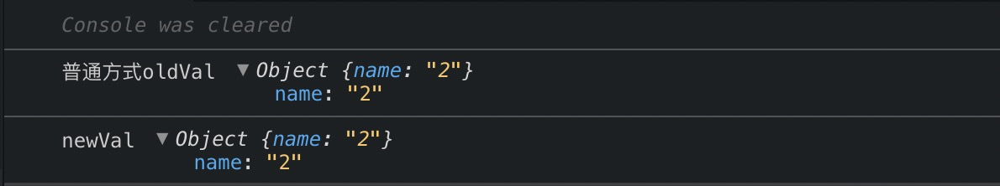
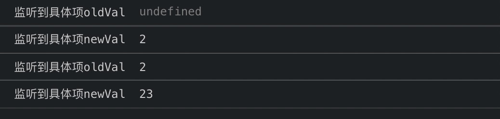
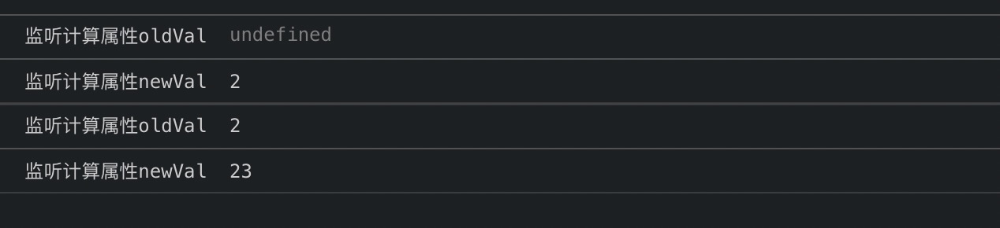
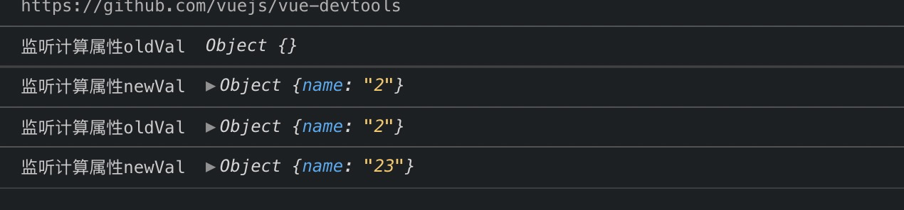

# watch 新旧值一致
> [Demo](https://codesandbox.io/s/watch-save-value-u1i6y)

## 场景
```javascript
<template>
  <div class="watch">
    <span>params.name:</span>
    <input type="text" v-model="params.name">
  </div>
</template>
```

```javascript
data() {
    return {
      params: {}
    };
  },
  watch: {
    params(newVal, oldVal) {
      console.log("普通方式oldVal", oldVal);
      console.log("普通方式newVal", newVal);
    }
  }

```
如上代码，input输入2，打印结果只打印一次且新旧值相等




## 官方的解释
> 注意：在变异(不是替换)对象或者数组时，旧值将与新值相等，因为它们的引用指向同一个对象/数组，Vue不会保留变异之前值的副本

## 解决方案

1. 监听到具体项

```javascript
watch() {
    "params.name"(newVal, oldVal) {
      console.log("监听到具体项oldVal", oldVal);
      console.log("监听到具体项newVal", newVal);
    }
}
```
input输入2，再输入3，打印结果如下：



2. 监听一个计算属性
```javascript
watch() {
    getParamsName(newVal, oldVal) {
      console.log("监听计算属性oldVal", oldVal);
      console.log("监听计算属性newVal", newVal);
    }
},
methods: {
    getParamsName() {
      return this.params.name;
    }
}
```
input输入2，再输入3，打印结果如下：



**或者**你想直接监听一个计算属性，但是**返回整体**，而不是具体项
```javascript
watch() {
    getParamsName(newVal, oldVal) {
      console.log("监听计算属性oldVal", oldVal);
      console.log("监听计算属性newVal", newVal);
    }
},
methods: {
    getParamsName() {
      return JSON.parse(JSON.stringify(this.params));
    }
}
```
input输入2，再输入3，打印结果如下：



::: danger 不应该使用箭头函数来定义 watcher 函数 
例如 searchQuery: newValue => this.updateAutocomplete(newValue)。理由是**箭头函数绑定了父级作用域的上下文**，所以 `this 将不会按照期望指向 Vue 实例`，this.updateAutocomplete 将是 undefined。
:::
