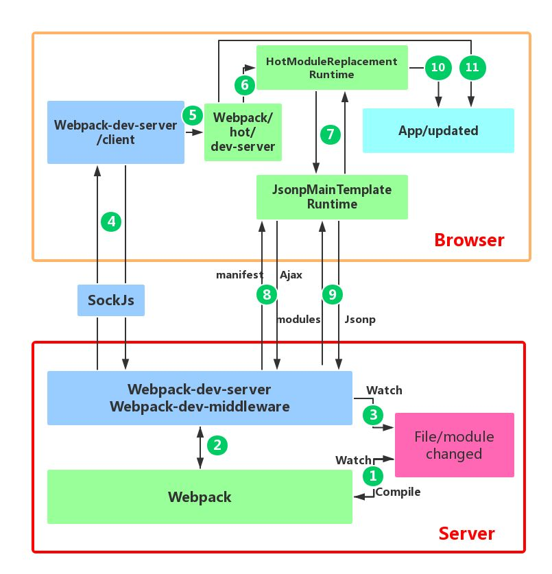

# webpack热更新原理

Webpack 的`热更新`又称热替换（`Hot Module Replacement`），缩写为 `HMR`。 这个机制可以做到**不用刷新浏览器而将新变更的模块替换掉旧的模块**。

## 热更新角色职责

- 浏览器端：
    - webpack-dev-server/`client`：只做消息传递，长连接拿到WDS的**热更新hash**。
    - webpack/hot/dev-server，简称 `dev-server`：热更新配置，判断决定给 HMR runtime 发 **热更新hash** 还是 直接刷新页面。
    - webpack/lib/HotModuleReplacement.runtime，简称 `HMR runtime`：
        - 1、拿到传来的**热更新hash**后，进一步调用`jsonp runtime`的方法：
            - ajax请求WDS，获得json（更新列表，包含**所有要更新的模块的 hash 值**）；
            - 再发送jsonp请求WDS，获得更新模块代码chunk。
        - 2、获取到更新模块代码chunk后，分**3阶段执行hotApply**完成热更新。
- 服务端：
    - webpack-dev-server（WDS）的中间件`webpack-dev-middleware`：
        - 1、监控watch文件系统代码变化，将变动模块打包到内存中；
        - 2、建立长连接Websocket，向webpack-dev-server/`client`推送更新模块的**热更新hash**。
        - 3、响应客户端 `HMR runtime`的ajax和jsonp请求，吐出更新模块代码chunk。

## 热更新步骤（原理）
- 底部红色框内是服务端，而上面的橙色框是浏览器端。
- 绿色的方框是 webpack 代码控制的区域。
- 蓝色方框是 webpack-dev-server 代码控制的区域。
- 洋红色的方框是文件系统，文件修改后的变化就发生在这。
- 青色的方框是应用本身。

HMR的核心就是客户端从服务端拉取更新后的文件，准确的说是 chunk diff (chunk 需要更新的部分)：
- 第一步：服务端（webpack-dev-server）的中间件 `webpack-dev-middleware` 调用 webpack API 对文件系统代码变化进行`监控（watch）`，并将代码**打包到内存中**；
- 第二步：当本地资源发生变化时，WDS 会通过 长连接Websocket 向 浏览器 推送 更新模块的hash（*实际上 WDS 与浏览器之间维护了一个 `Websocket`，以便将 webpack 编译和打包的各个阶段状态告知浏览器。*）。
- 第三步：客户端（webpack-dev-server/client）拿到新模块`热更新hash`后将工作交由webpack，根据 webpack/hot/dev-server 的 hot 配置如果配置了热更新，就向 webpack 发送 `热更新hash`。如果没配置热更新，则刷新页面；
- 第四步：客户端 HMR runtime 监听到 `热更新hash`后，会调用 check方法，进一步向 WDS 发起`Ajax`请求来获取更改内容(文件列表、hash)，再借助这些信息继续向 WDS 发起`jsonp`请求获取该chunk的增量更新代码。
- 第五步：HMR runtime 拿到新的chunk代码后，就会进行模块热更新操作，它调用自身的 hotApply，分三个阶段完成代码替换：找出过时的模块和依赖，从缓存中删除，将新模块添加到modules中。

**HotModuleReplacementPlugin** 提供了相关 API 以供开发者针对自身场景进行处理，像**react-hot-loader** 和 **vue-loader** 都是借助这些 API 实现 HMR。

#### 第一步的问题解释
> Q：webpack 可以将不同的模块打包成 bundle 文件或者几个 chunk 文件，但是通过 webpack HMR 进行开发的过程中，dist目录中并没有找到 webpack 打包好的文件，它们打包去哪呢？

原来 webpack 将 bundle.js 文件代码作为一个js对象，被打包到了`内存中`，不生成文件的原因就在于访问内存中的代码比访问文件系统中的文件更快，而且也减少了代码写入文件的开销，这一切都归功于memory-fs，`memory-fs` 是 webpack-dev-middleware 的一个依赖库，webpack-dev-middleware 将 webpack 原本的 `outputFileSystem` 替换成了 `MemoryFileSystem` 实例，这样代码就将输出到内存中。

> Q：通过查看 webpack-dev-server 的 package.json 文件，我们知道其依赖于 webpack-dev-middleware 库，那么 webpack-dev-middleware 在 HMR 过程中扮演什么角色？

webpack-dev-server 和 webpack 之间的接口交互，主要是 dev-server的中间件 webpack-dev-middleware 和 webpack 之间的交互，webpack-dev-middleware 调用 webpack 暴露的 API对文件系统代码变化进行监控(watch)，并且告诉 webpack，将代码打包到内存中。

#### 第二步第三步的问题解释
> Q：使用 HMR 的过程中，浏览器是通过 websocket 和 webpack-dev-server 进行通信的，但是 websocket 的 message 中并没有发现新模块代码。打包后的新模块又是通过什么方式发送到浏览器端的呢？为什么新的模块不通过 websocket 随消息一起发送到浏览器端呢？

功能块的解耦，各司其职，client 只负责消息的传递而不负责新模块的获取，HMR runtime 才应该是获取新代码的地方。

#### 第四步的问题解释
> Q：HMR 过程中，如何拿到更新的代码？

浏览器端的`HMR runtime`(webpack/lib/HotModuleReplacement.runtime)拿到`热更新hash`后，通过 `jsonp runtime`(JsonpMainTemplate.runtime) 向 server端`WDS` 发送 **Ajax** 请求获取一个 json，该 json 包含了*所有要更新的模块的 hash 值*，获取到更新列表后，该模块再次通过 **jsonp** 请求，获取到最新的模块代码。

#### 第五步的问题解释
> Q：浏览器拿到最新的模块代码，HMR 又是怎么将老的模块替换成新的模块，在替换的过程中怎样处理模块之间的依赖关系？

模块热更新都是发生在 `HMR runtime` 中的 hotApply 方法中，替换主要分`三个阶段`：
- 第一个阶段是找出 outdatedModules 和 outdatedDependencies；
- 第二个阶段从缓存中删除过期的模块和依赖；
- 第三个阶段是将新的模块添加到 modules 中，当下次调用 `__webpack_require__ `(webpack 重写的 require 方法)方法的时候，就是获取到了新的模块代码了。

> Q：当模块的热替换过程中，如果替换模块失败，有什么回退机制吗？

模块热更新的错误处理，如果在热更新过程中出现错误，热更新将**回退到`刷新浏览器`**：dev-server 先验证是否有更新，没有代码更新的话，重载浏览器。如果在 hotApply 的过程中出现 abort 或者 fail 错误，也进行重载浏览器。

## 参考链接

- [Webpack HMR 原理解析](https://zhuanlan.zhihu.com/p/30669007)
