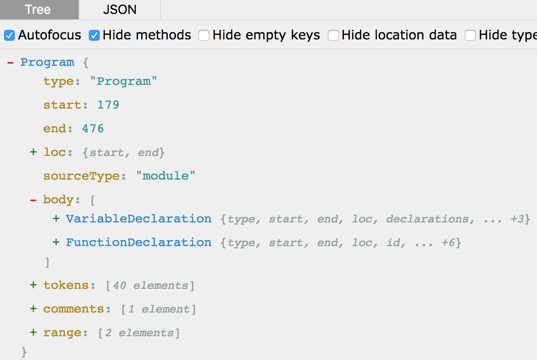
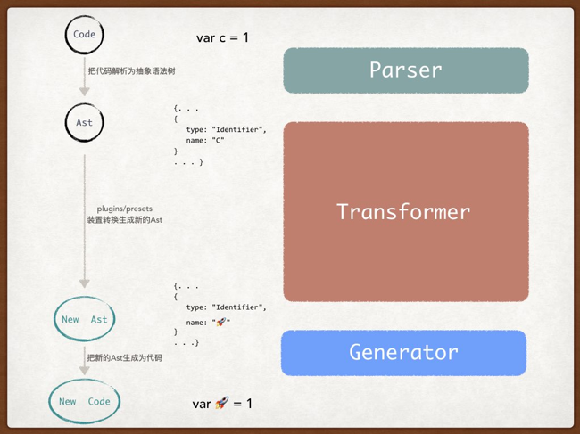

# 关于babel

## 什么是babel
Babel: The compiler for writing next generation JavaScript。
- `babel`最开始的名字叫`6to5`，作用是把一些浏览器根本就不识别的代码，转换成浏览器识别的代码。
- `babel` 对于 `AST` 就相当于 jQuery 对于 DOM, 就是说`babel`给予了我们便捷查询和修改 `AST` 的能力。
    - 抽象语法树(`AST` -> Abstract Syntax Tree)：将程序用树状结构表示出声明、变量、函数等等。**是不同代码转换过程中的桥梁**。
    

## 3步转换
为了转换代码，babel做了三件事：
- `Parser`：解析原有代码转换为AST。**(code => 旧AST)**
- `Transformer`：利用配置好的`plugins/presets`把`Parser`生成的AST转变为新的AST。**（旧AST => 新AST）**
- `Generator`：把转换后的新AST生成新的代码。**（旧AST => code）**



#### Parser 解析（步骤一）
解析步骤接收代码并输出 AST,这其中又包含两个阶段**词法分析**和**语法分析**。词法分析阶段把字符串形式的代码转换为 令牌（tokens）流。语法分析阶段会把一个令牌流转换成 AST 的形式,方便后续操作。

#### Transformer生成（步骤二*重点）
babel的最主要工作都集中Transformer上，即在把解析生成的AST经过`plugins/presets`然后去生成新的AST。babel拿到抽象语法树后会使用**babel-traverse**进行递归的**深度优先树状遍历**，并按照特定配置规则完成转换。

#### Generator 生成（步骤三）
代码生成步骤把最终（经过一系列转换之后）的 AST 转换成字符串形式的代码，同时还会**创建源码映射**（`source maps`）。代码生成其实很简单：深度优先遍历整个 AST，然后构建可以表示转换后代码的字符串。


## Babel567的变化

#### Babel分包
- 此前，Babel囊括了整个编译器、所有的转换器以及一个CLI工具，虽然方便使用，但缺点就是它会导致很多不必要的下载。
- Babel6 不再是一个整体包了，它分为了两个单独的包（babel-cli 和 babel-core），此外还有一些插件预设（如babel-preset-es2015、babel-preset-react等）：

#### babel-core和babel-cli的区别
- 在命令行使用Babel，安装babel-cli
- 在一个Node项目中使用Babel，使用babel-core


#### 声明作用域@babel/core
- 在 Babel7 中 `babel-core` 和 `babel-preset` 被建议使用 `@babel` 开头**声明作用域**，因此应该分别下载 `@babel/core` 和· `@babel/presets`。就类似于 vue-cli 升级后 使用@vue/cli一样的道理。
- **`@babel/core` 这个库负责「`Parser解析`」，具体的「`Transformer转换`」和「`Generator生成`」步骤则交给各种插件（`plugin`）和预设（`preset`）来完成。**


## .babelrc 配置
- presets：官方的插件合集，官方推荐env，省略了前缀。
- targets：说明你的web应用需要兼容到那一部分的浏览器。
- plugins：一般会加上transform-runtime，自动帮你加载你需要的polyfill。
```json
// .babelrc
{
    "presets": [
        ["env", {
            "debug": true,
            "targets": {
                "browsers": ["> 1%", "last 3 versions", "not ie <= 9"]
            }
        }],
        "stage-2"
    ],
    "plugins": ["transform-runtime"]
}
```

#### presets 和 plugin 的区别

presets其实是一组plugin的集合：
```json
{
    "presets": [
        "myPreset",
        "babel-preset-myPreset" // equivalent
    ],
    "plugins": [
        "myPlugin",
        "babel-plugin-myPlugin" // 两个插件实际是同一个
    ]
}
```
注：前缀都是`babel-preset-`和`babel-plugin-`，可以省略这些前缀。


#### env 和 es2015、es2016、es2017和 stage-x 的区别

- `env` 同时包含了es2015、es2016、es2017以及最新版本，也是**官方推荐的**。
- es2015(ES6)会编译2015年通过javascript提案，成为正式版本的那一部分语法，以此类推。
- `stage-x` 会编译 **试用和实验阶段的javascript提案**。
    - `一般在开发项目时会加上stage-2`：
```
TC39 将提案分为以下几个阶段:
    Stage 0 - 稻草人: 只是一个想法，可能是 babel 插件。
    Stage 1 - 提案: 初步尝试。
    Stage 2 - 初稿: 完成初步规范。
    Stage 3 - 候选: 完成规范和浏览器初步实现。
    Stage 4 - 完成: 将被添加到下一年度发布。
```

## 常用babel插件
名称 | 作用 | 备注
-|-|-
babel/cli | 许命令行使用 babel 命令转译文件 | 一般在写插件时使用
babel/polyfill | 为所有 API 增加兼容方法 | 需要在所有代码之前 require，且体积比较大
babel/plugin-transform-runtime | 把帮助类方法从每次使用前定义改为统一 require，精简代码 | ---
babel/runtime | helper库 | 需要安装为依赖，而不是开发依赖，node环境使用，web环境不需要
babel/loader | babel插件在webpack项目中的一个入口 | ---
babel/core | babel的polyfill库 | ---
babel/preset-env | babel预制环境的集合插件，通过配置目标环境，转换标准上的新特性 | 只转新特性，不转api
babel/preset-stage-2 | 转换草案stage-2以及stage-3阶段的的新属性 | ---

#### babel-polyfill
Babel 几乎可以编译所有时新的 JavaScript 语法，但对于 APIs 来说却并非如此。比如说：Promise、WeakMap、Array.from 、Object.assign、Array.prototype.includes、generator等。为了解决这个问题，我们使用一种叫做 Polyfill（代码填充，也可译作兼容性补丁） 的技术。

