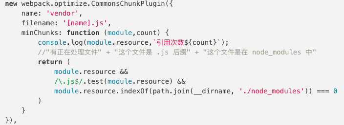

# Code Spliting

## 什么是 code splitting

代码分割（code splitting）是指，将项目代码中无需立即调用的代码，在代码构建时转变为异步加载的过程。将项目代码构建打包时，根据指定规则分割成多个 bundles（输出文件），这些模块文件可以被按需动态加载或者并行加载。

## 代码分割的意义
代码分割的本质其实就是在**源代码直接上线**和**打包成唯一脚本**main.bundle.js这两种极端方案之间的一种更适合实际场景的`中间状态`。是「`用可接受的服务器性能压力增加来换取更好的用户体验`」。

- **源代码直接上线**：虽然过程可控，但是http请求多，性能开销大。
- **打包成唯一脚本**：一把梭完自己爽，服务器压力小，但是页面空白期长，用户体验不好。

## 代码分割入手点

可以从以下3个方面去配置代码分割：
- 1、`入口文件方式（Entry Points）`：通过手动指定 webpack 打包入口文件（entry），可以**配置多个入口文件**，打包不同的代码，然后根据业务需求，实现代码块的加载。
- 2、`动态引入/懒加载（Dynamic Imports/Lazy-Loading）`：通过使用例如 es6 的[import()](http://webpack.js.org/api/module-methods/#import-1)、[require.ensure](https://webpack.js.org/api/module-methods#requireensure)、[AMD](https://webpack.js.org/api/module-methods#amd)等方法来指定代码进行构建分割。
- 3、`避免重复（Prevent Duplication）`：
  - **webpack3**：`CommonsChunkPlugin`提取公共代码块被。
  - **webpack4**：`SplitChunksPlugin`自动分割，通过[SplitChunksPlugin](https://webpack.js.org/plugins/split-chunks-plugin/)来配置代码构建的自动分割。

## 代码分割类型（两种）

### 静态代码分割

静态代码分割：在代码中明确声明需要异步加载的代码。调用一个声明了异步加载代码的变量时，它总是返回一个 Promise 对象。

```js
import Listener from './listeners.js'
const getModal = () => import('./src/modal.js') 
Listener.on(
  'didSomethingToWarrentModalBeingLoaded',
  () => {
    // Async fetching modal code from a separate chunk
    getModal().then(
      (module) => {
        const modalTarget = document.getElementById('Modal')    
        module.initModal(modalTarget)  
      })
  }
)
```

### 动态代码分割

动态代码分割：在代码调用时根据当前的状态，「动态地」异步加载对应的代码块。
```js
const getTheme = (themeName) => import(`./src/themes/${themeName}`)
// using `import()` 'dynamically'
if (window.feeling.stylish) {
  getTheme('stylish').then((module) => {
    module.applyTheme()
  })
} else if (window.feeling.trendy) {
  getTheme('trendy').then((module) => {
    module.applyTheme()
  })
}
```

## 魔法注释

魔术注释是由 Webpack 提供的，可以为代码分割服务的一种技术。通过在 import 关键字后的括号中使用指定注释，我们可以对代码分割后的 chunk 有更多的控制权，让我们看一个例子：

#### 对分离出的 chunk 进行命名
（`webpackChunkName`）
```js
// index.js
import (
  /* webpackChunkName: “my-chunk-name” */
  './footer'
)
```
```js
// webpack.config.js
{
  output: {
    filename: “bundle.js”,
    chunkFilename: “[name].lazy-chunk.js”
  }
}
```

#### 对异步加载模块不同打包模式
（`webpackMode`）
```js
// index.js
import (
  /* webpackChunkName: “my-chunk-name” */
  /* webpackMode: lazy */
  './someModule'
)
```
webpackMode：
- 默认值为`lazy`，它会使所有异步模块都会被**单独抽离**成单一的 chunk。
- 若设置该值为`lazy-once`，Webpack 就会将所有带有标记的异步加载模块**放在同一个** chunk 中。


#### 使异步模块预加载
（`webpackPrefetch`、`webpackPreload`）
```js
import(
  /* webpackPrefetch: true */
  './someModule'
)
```
让浏览器会在 **Idle（空闲时间）** 状态时预先帮我们加载所需的资源：
- `webpackPrefetch`：令我们可以使用与 `<link rel=“prefetch”>` 相同的特性。
- `webpackPreload`：令我们可以使用与 `<link rel=“preload”>` 相同的特性。


## 避免重复（webpack3与webpack4）

### 两个版本的解决方案

```js
// webpack.config.js (for webpack 4)
module.exports = {
  optimization: {
    splitChunks: {
      chunks: 'all', // 智能将依赖项提取到独立的 chunk 中, vendor.js
    }
    runtimeChunk: true, // 提取runtime.js 或叫 manifest.js
  },
};

```
```js
// webpack.config.js (for webpack 3)
module.exports = {
  plugins: [
    new webpack.optimize.CommonsChunkPlugin({
      name: 'vendor',
      // 这个函数决定哪个模块会被打入 chunk
      minChunks: module => module.context &&
        module.context.includes('node_modules'),
    }),

    // 必须在 vendor 生成之后执行（因为 webpack 把runtime打进了最新的 chunk）
    new webpack.optimize.CommonsChunkPlugin({
      name: 'runtime',
      // minChunks: Infinity 表示任何应用模块都不能打进这个 chunk
      minChunks: Infinity,
    }),
  ],
};
// 注意：包含 vendor 的 CommonsChunkPlugin 实例必须在包含 runtime 的之前，否则会报错。
```


### SplitChunksPlugin
**Webpack4 废弃了 CommonsChunkPlugin**，引入了 `optimization.splitChunks` 这个选项，默认是不用设置的。Webpack 4 引入了 mode 这个选项（提供**development**、**production**两种模式）。**如果 mode 是 `production`，那 Webpack 4 就会开启 Code Splitting**。

#### 默认自动分割（普通应用）
```js
// 默认配置
splitChunks: {
    // 表示选择哪些 chunks 进行分割，可选值有：async，initial和 all
    chunks: "async",
    // 表示新分离出的chunk必须大于等于minSize，默认为30000，约30kb。
    minSize: 30000,
    // 表示一个模块至少应被minChunks个chunk所包含才能分割。默认为1。
    minChunks: 1,
    // 表示按需加载文件时，并行请求的最大数目。默认为5。
    maxAsyncRequests: 5,
    // 表示加载入口文件时，并行请求的最大数目。默认为3。
    maxInitialRequests: 3,
    // 表示拆分出的chunk的名称连接符。默认为~。如chunk~vendors.js
    automaticNameDelimiter: '~',
    // 设置chunk的文件名。默认为true。当为true时，splitChunks基于chunk和cacheGroups的key自动命名。
    name: true,
    // cacheGroups 下可以可以配置多个组，每个组根据test设置条件，符合test条件的模块，就分配到该组。模块可以被多个组引用，但最终会根据priority来决定打包到哪个组中。默认将所有来自 node_modules目录的模块打包至vendors组，将两个以上的chunk所共享的模块打包至default组。
    cacheGroups: {
        vendors: {
            test: /[\\/]node_modules[\\/]/,
            priority: -10
        },
        // 
    default: {
            minChunks: 2,
            priority: -20,
            reuseExistingChunk: true
        }
    }
}
```
Webpack4 的 Code Splitting 默认会**基于内置规则自动拆分**：
- 新 bundle 被两个及以上模块引用，或者来自 node_modules
- 新 bundle 大于 30kb （压缩之前）
- 异步加载并发加载的 bundle 数不能大于 5 个
- 初始加载的 bundle 数不能大于 3 个

简单的说，Webpack 会把代码中的公共模块自动抽出来，变成一个包，前提是这个包大于 30kb，不然 Webpack 是不会抽出公共代码的。对于普通的应用，Webpack 4 内置的规则就足够了。

#### 特殊应用需求
对于特殊的需求，splitChunks 有一个参数叫 `cacheGroups`，可以定义自定义 chunk 组，通过 test 条件对模块进行过滤，符合条件的模块分配到相同的组。

#### chunks选项（async、 initial 和 all）
chunks 用以告诉 splitChunks 的作用对象，其可选值有 `async`、 initial 和 `all`。
- **默认值**是 `async`，也就是默认只选取异步加载的chunk进行代码拆分。
- 值为 `all` 时，处理范围包括了初始chunk和异步chunk。推荐在开发中将 chunks 设置为 all。
- 值为 initial 时，作用范围变成了非异步加载的初始 chunk。


### CommonsChunkPlugin
webpack3中使用的分割插件，因为配置规则太复杂，导致实际的工作中只能来回复制配置规则，因此已被业界弃用。但这里还是简单介绍下：
```js
new webpack.optimize.CommonsChunkPlugin({
    name: 'manifest',
    minChunks: Infinity
})
```
`Infinity`是无限的意思，这就是说必须有无限多个代码chunk都用到了这个js文件，我们才把它抽取出来放到这个公共大块里，很显然，不可能有 js文件满足“被无限多个”代码chunk使用，所以这里生成的其实就是一个空的chunk，它只有一个文件名manifest，而文件长度是0，用来“生成 webpack 运行时代码（runtime）”。这就是minChunks: Infinity的作用。

`minChunks`作为函数的时候，说一下minChunks作为函数两个参数的含义：
- module：当前chunk及其包含的模块
- count：当前chunk及其包含的模块被引用的次数
minChunks作为函数会遍历每一个入口文件及其依赖的模块，返回一个布尔值，为true代表当前正在处理的文件（module.resource）合并到commons chunk中，为false则不合并。



上面的代码其实就是生成一个叫做vendor的commons chunk，那么有哪些模块会被加入到vendor中呢？就对入口文件及其依赖的模块进行遍历，如果该模块是js文件并且在node_modules中，就会加入到vendor当中，其实这也是一种让vendor只保留第三方库的办法。

## 各种框架实现懒加载

- React: [Code Splitting and Lazy Loading](https://reacttraining.com/react-router/web/guides/code-splitting)
- Vue: [Lazy Load in Vue using Webpack's code splitting](https://alexjoverm.github.io/2017/07/16/Lazy-load-in-Vue-using-Webpack-s-code-splitting/)
- AngularJS: [AngularJS + Webpack = lazyLoad](https://medium.com/@var_bin/angularjs-webpack-lazyload-bb7977f390dd)


## 参考链接

- [【译】Google - 使用 webpack 进行 web 性能优化（二）：利用好持久化缓存](https://juejin.im/post/5b9b0fdfe51d450e7210892d#heading-16)
- [项目不知道如何做性能优化？不妨试一下代码分割](https://juejin.im/post/5e796ec1e51d45271e2a9af9#heading-5)
- [Webpack 4 配置最佳实践](https://juejin.im/post/5b304f1f51882574c72f19b0#heading-7)
- [如何使用 splitChunks 精细控制代码分割](https://juejin.im/post/5e7c83b4e51d455c6c269608#heading-9)
- [「吐血整理」再来一打Webpack面试题](https://juejin.im/post/5e6f4b4e6fb9a07cd443d4a5)

