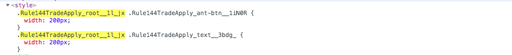
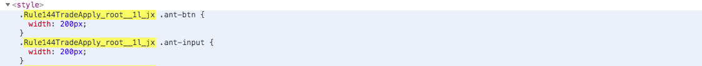

# 简单易懂的CSS Modules

## CSS的痛点

我们都知道，css入门简单，深入就比较难，样式简单维护难，css痛点有很多：
1. css的规则是全局的，任何一个组件的样式规则，都对整个页面有效，很容易出现全局污染（覆盖）问题；
2. 为了解决全局污染问题，那就吧class命名写长一点、加一层父级选择器、降低冲突几率，但css命名就混乱了；
3. 组件依赖管理不彻底，组件应该相互独立，引入一个组件时，应该只引入它所需要的 CSS 样式。


## CSS Module
为了解决一上问题，就产生了css module。`css module会产生局部作用域`，它会产生一个独一无二的`class`名字，不会与其他同名选择器重名。

### 启用 css module
在项目里应用CSS Modules有很多方法，目前比较常用的是使用webpack的[css-loader](https://github.com/webpack-contrib/css-loader#css-modules)，此处是与sass一起使用的：

```js
module: {
    rules: [
      {
        test: /\.scss/,
        exclude: /node_modules/,
        use: [
            {
                loader: 'style-loader'
            }, {
                loader: 'css-loader',
                options: {
                    modules: true,   // 开启 css module
                }
            }, {
                loader: 'postcss-loader'    // 自动添加css前缀
            }, {
                loader: 'sass-loader',
                options: {
                    sourceMap: true,
                    outputStyle: {
                        expanded: true
                    }
                }
            }
        ]
      }
    ]
  }
```

### 使用css module

编写 scss
```scss
.root {
  .text {
    width: 200px;
  }
}
```
使用
```typescript jsx
import styles from './index.scss';

<div className={styles.root}>
    <div className={styles.text}>test</div>
</div>
```
编译之后

可以看出css module为每个class生成了唯一的class类名，它将class转换成对应的全局唯一hash值来形成`局部作用域`。
css module默认使用的是`局部作用域`，就相当于给每个 class 名外加了一个 :local 这是默认的，也可以显式使用，但是当需要修改第三方组件的class时，就需要使用`全局作用域`来更改类。

```scss
:local(.root) {     // 默认是局部作用域
  :local(.text){
    width: 200px;
  }
  :global {     // 修改第三方组件（antd）,使用全局作用域，但是他是相对于.root底下的全局作用域，所已完全不必担心污染其他组件
    .ant-btn {
      width: 200px;
    }
    .ant-input {
      width: 200px;
    }
  }
}
```

图上所知，加上global属性，就会在相对应的root底下的`全局作用域`找类名，那么他们在元素上用法的区别就是局部作用域需要使用js式（styls.xxx）;全局作用域的就是直接使用

```typescript jsx
.root {
    .text {
        width: 200px
    }
    :global {
        .text2 {
             width: 200px
        }
    }
}

import styles from './index.scss';

<div className={styles.root}>
    <div className={styles.text}>test</div>
    <div className='text2'>test2</div>  // 直接使用
</div>

```
## 其他
*[vue中使用css module](https://vue-loader.vuejs.org/zh/guide/css-modules.html#%E7%94%A8%E6%B3%95)*

## 结语
无论是一直以来我们认真遵循的命名约定，还是这个新的CSS Modules，目的都是一样的：可维护的css代码。我觉得就CSS Modules基本还是在写css这一点来说，它还是很友好的。


