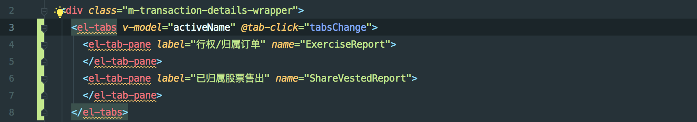
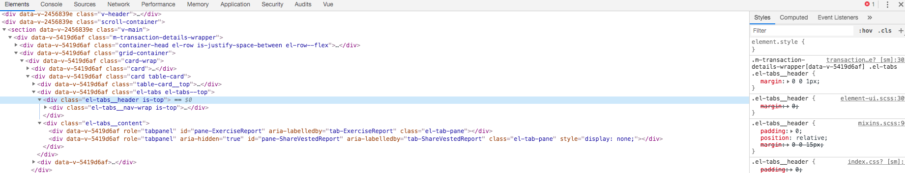
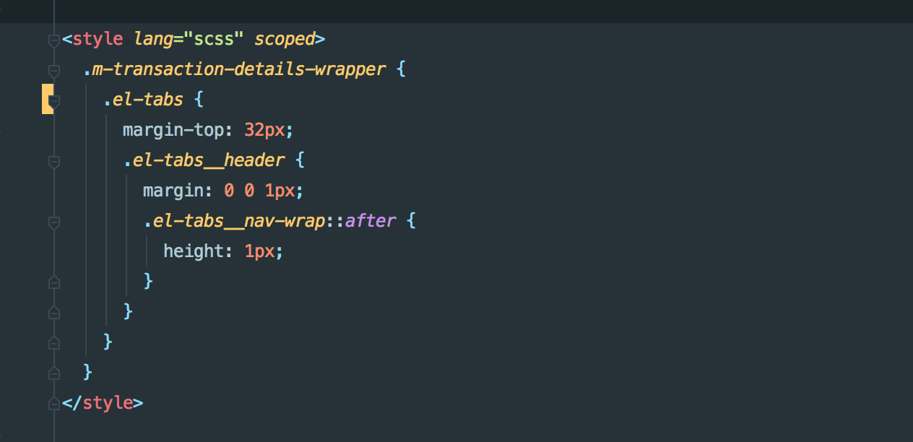
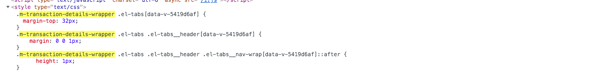
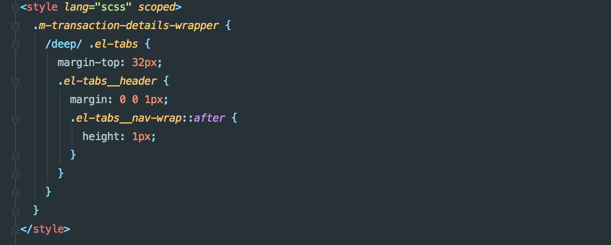
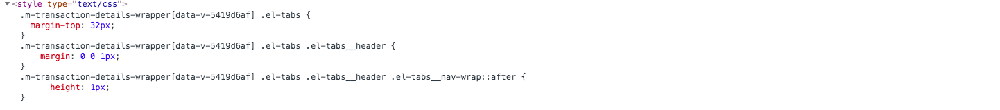

### vue css中/deep/用法

`/deep/`的意思大概为深入的，深远的（深度选择）。Scoped CSS规范是Web组件产生不污染其他组件，也不被其他组件污
染的CSS规范。这样在打包的时候会生成一个独一无二hash值，这样父组件的样式就不会影响到子组件了；再用别人或者第三
方组件是，要是想修改其组件的样式，一般都是提取公共文件，但是存在问题是有时候你修改一处就可能影响到别的地方，这
个时候就可以需要一种方式，既不影响别的地方，又能修改子组件的样式。

- *加入scoped属性*

可以看出，scoped属性会将 template 中的每个元素加入 [data-v-xxxx]的hash值，但如果引用了第三方组件，`默认只会对组件的最外层（div）加入这个 [data-v-xxxx] 属性，但第二层开始就没有效果了`，如上图所示，第一层el-tabs加上了[data-v-xxxx]，底下
的el-tabs__header就没有了

- *这个时候修改样式，未加/deep/*

编译后的css可以看出，寻找的路径为`.m-transaction-details-wrapper .el-tabs .el-tabs__header[data-v-5419d6af]`
但是在看html元素上，并没有在`.el-tabs__header`加入[data-v-5419d6af]，所以导致不生效

- *加上/deep/*

此时编译后的css寻找路径为`.m-transaction-details-wrapper[data-v-5419d6af] .el-tabs .el-tabs__header`,就可以生
效了，这类似于css module中的global属性，加上global修改第三方组件才能生效