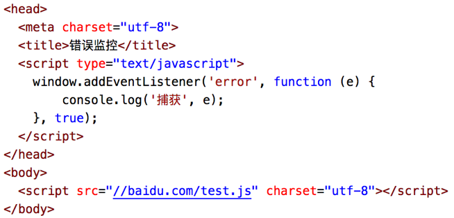
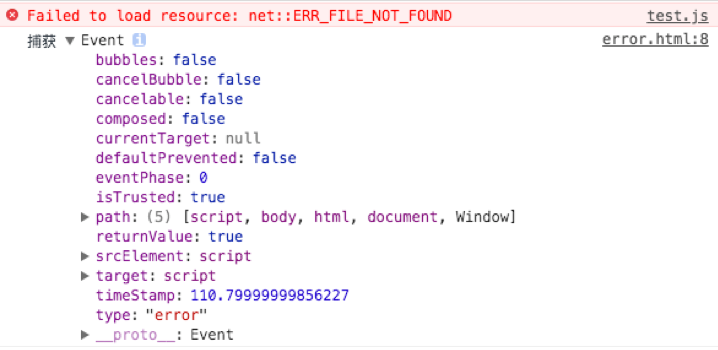
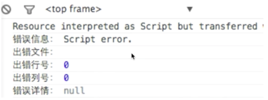
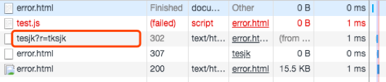

# 如何保证产品质量

## 错误监控

### 前端错误的分类

- 即时运行错误：代码错误
- 资源加载错误

### 错误的捕获方式

#### 即时运行错误的捕获方式：

- try..catch..
- window.onerror

#### 资源加载错误的捕获方式：

- object.onerror 比如 img.onerror
- performance.getEntries()：用 2 需要的去除 1 中已经加载到的资源就是加载失败的资源
  1. performance.getEntries().forEach(item=>{console.log(item.name)}) 遍历出来页面中所有加载到的资源；
  2. document.getElementsByTagName('img') 拿到所有需要的某种需要的资源
- Error 事件捕获
  
  - true 代表事件捕获，通过一个 script 标签加载一个不存在的文件，即可捕获该事件错误
    
  - 如果是 false，也就是事件冒泡，只报错但获取不到该错误
    

#### 延伸：跨域的 js 运行错误可以捕获吗，错误提示是什么，应该怎么处理?



可以捕获，但是只能知道 script error，但无法拿到行号列号。通常跨域的异常信息会被忽略，不会上报。处理方法是：

1. 在客户端 script 标签增加 crossorigin 属性；

```html
<script src="http://sub.domain.com/script.js" crossorigin="anonymous"></script>
```

2. 在服务端设置 js 资源响应头 Access-Control-Allow-Origin: \*

就可以拿到具体的跨域的 js 运行错误了。

### 错误上报的常用方法与原理

1. 采用 Ajax 通信的方式上报(但实际中没人用这种方式)；
2. 利用 Image 对象上报(实际应用中的错误上报方式。利用这种方式非常简单，比 ajax 简单，且无需第三方的库)；

```html
<script type="text/javascript">
	// 通过赋值图片src确定错误上报地址
	new Image().src = "https://baidu.com/testjk?r=tksjk";
</script>
```


