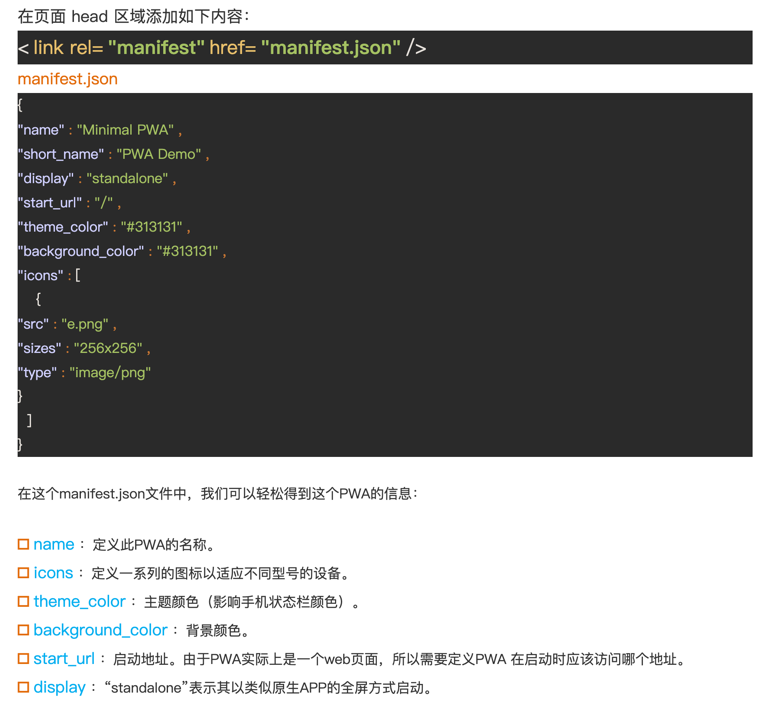
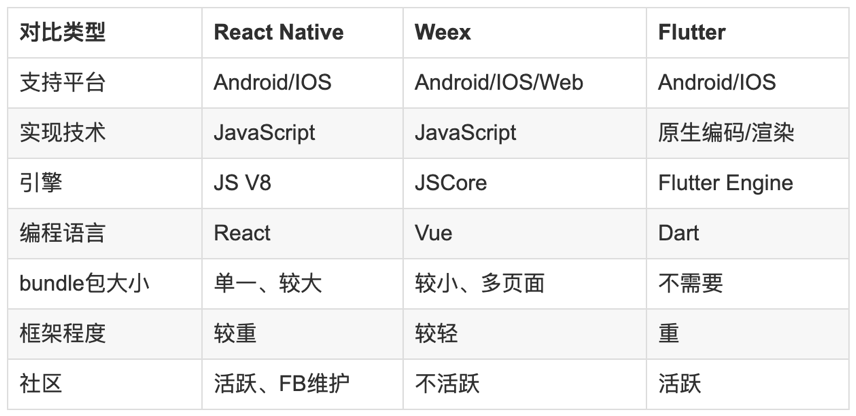

# Progressive Web Apps

## 什么是PWA
`Progressive Web App`,(`渐进式增强 WEB 应用`)简称PWA，是提升WebApp的体验的一种新方法，能给用户原生应用的体验。PWA本质上是 Web App，借助一些新技术也具备了Native App的一些特性，兼具 Web App和Native App的优点。

### PWA 使用前提
- 浏览器支持（`cacheAPI`、HTML5 `fetch API` 和 `Promise`）
- 只能使用`https`协议

::: details
- Service Worker要求HTTPS 的环境，当然一般浏览器允许调试 Service Worker 的时候 host 为 localhost 或者 127.0.0.1 也是 ok 的。**注意：** 当地启动地址为172.0...这类的自然也无法获取到Service Worker。
- Service Worker 的缓存机制是依赖 [Cache API](https://developer.mozilla.org/zh-CN/docs/Web/API/Cache) 实现的。
- 依赖 HTML5 fetch API 和 Promise。
:::

### PWA 主要特点
- **可靠**：即使在不稳定的网络环境下，也能瞬间加载并展现
- **快**：快速响应，并且 动画平滑流畅
- **有粘性**：用户可以添加到桌面和接收通知
- **沉浸式的用户体验**：沉浸式特点是只显示内容区域，没有状态栏，导航栏，工具栏等

### PWA 主要技术点
- 离线可用( Service Worker )  
- 主屏图标( App Manifest )  
- 骨架屏幕( App Shell )
- 推送通知( Push API & Notification API )  


## Service Worker 离线可用

当在HTML页面中执行脚本时，页面的状态是不可响应的。 而web worker是运行在后台的JavaScript，独立于其他脚本，不会影响页面的性能。用户可以继续做任何愿意做的事情：点击、选取内容等等，而此时web  worker在后台运行.

### 浏览器有3类 Web Worker
- **Dedicated Worker**：专用的worker，只能被创建它的 JS 访问，创建它的页面关闭，它的生命周期就结束了。
- **Shared  Worker**：共享的worker，可以被同一域名下的JS访问，关联的页面都关闭时，它的生命周期就结束了。
- **Service Worker**：`事件驱动的worker`，生命周期与页面无关，关联页面未关闭时，它也可以退出，没有关联页面时，它也可以启动。**Service Worker表示离线缓存文件**，其本质是**Web应用程序与浏览器之间的`代理服务器`**，**可以在网络可用时作为浏览器和网络间的代理，也可以在离线或者网络极差的环境下使用离线的缓存文件**。

### 其实也可以分为两类 Web Worker

- `Dedicated Worker` 和 `Shared Worker` 专注于解决「**耗时的JS执行 影响 UI响应**」的问题。他们的最主要能力：
  - 1是后台运行 JS，不影响 UI 线程；
  - 2是使用消息机制实现并行，可以监听 onmessage 事件。
- `Service Worker` 则是为解决「**Web App 的用户体验不如 Native App**」的普遍问题。显然 service worker 的使命更加远大，虽然规范把它定义为 web worker，但它已不是一个普通的 worker了。

### Service Worker生命周期  
- ***安装(installing)*** ：这个状态发生在 Service Worker 注册之后，表示开始安装，触发 install 事件回调指定一些静态资源进行离线缓存。
  - install 事件回调中有两个方法：
    - event.waitUntil()：传入一个 Promise 为参数，等到该 Promise 为 resolve 状态为止。
    - self.skipWaiting()：self 是当前 context 的 global 变量，执行该方法表示强制当前处在 waiting 状态的 Service Worker 进入 activate 状态。
- ***安装后( installed )*** ：Service Worker 已经完成了安装，并且等待其他的 Service Worker 线程被关闭。
- ***激活( activating )*** ：在这个状态下没有被其他的 Service Worker 控制的客户端，允许当前的 worker 完成安装，并且清除了其他的 worker 以及关联缓存的旧缓存资源，等待新的 Service Worker 线程被激活。
  - activate 回调中有两个方法：
    - event.waitUntil()：传入一个 Promise 为参数，等到该 Promise 为 resolve 状态为止。
    - self.clients.claim()：在 activate 事件回调中执行该方法表示取得页面的控制权, 这样之后打开页面都会使用版本更新的缓存。旧的 Service Worker 脚本不再控制着页面，之后会被停止。
- ***激活后( activated )*** ：在这个状态会处理 activate 事件回调 (提供了更新缓存策略的机会)。并可以处理功能性的事件 fetch (请求)、sync (后台同步)、push (推送)。
- ***废弃状态 ( redundant )*** ：这个状态表示一个 Service Worker 的生命周期结束。这里特别说明一下，进入废弃 (redundant) 状态的原因可能为install失败或者activating失败。


### 注册安装更新
::: details 具体实操
**注册Service Worker**

> [为什么用load监听](https://developers.google.com/web/fundamentals/primers/service-workers/registration)

```js
if ('serviceWorker' in navigator) {
  window.addEventListener('load', function () {
      navigator.serviceWorker.register('/sw.js', {scope: '/'})
          .then(function (registration) {

              // 注册成功
              console.log('ServiceWorker registration successful with scope: ', registration.scope);
          })
          .catch(function (err) {

              // 注册失败:(
              console.log('ServiceWorker registration failed: ', err);
          });
  });
}
```

**安装Service worker**
```js
  // 监听 service worker 的 install 事件
  this.addEventListener('install', function (event) {
      // 如果监听到了 service worker 已经安装成功的话，就会调用 event.waitUntil 回调函数
      event.waitUntil(
          // 安装成功后操作 CacheStorage 缓存，使用之前需要先通过 caches.open() 打开对应缓存空间。
          caches.open('my-test-cache-v1').then(function (cache) {
              // 通过 cache 缓存对象的 addAll 方法添加 precache 缓存
              return cache.addAll([
                  '/',
                  '/index.html',
                  '/main.css',
                  '/main.js',
                  '/image.jpg'
              ]);
          })
      );
  });
```

**响应请求**

> clone的缘故是因为response读取即流失，如果不克隆赋值得到的就会是undefind

```js
this.addEventListener('fetch', function (event) {
  event.respondWith(
      caches.match(event.request).then(function (response) {
          // 来来来，代理可以搞一些代理的事情

          // 如果 Service Worker 有自己的返回，就直接返回，减少一次 http 请求
          if (response) {
              return response;
          }

          // 如果 service worker 没有返回，那就得直接请求真实远程服务
          var request = event.request.clone(); // 把原始请求拷过来
          return fetch(request).then(function (httpRes) {

              // http请求的返回已被抓到，可以处置了。

              // 请求失败了，直接返回失败的结果就好了。。
              if (!httpRes || httpRes.status !== 200) {
                  return httpRes;
              }

              // 请求成功的话，将请求缓存起来。
              var responseClone = httpRes.clone();
              caches.open('my-test-cache-v1').then(function (cache) {
                  cache.put(event.request, responseClone);
              });

              return httpRes;
          });
      })
  );
});
```
**版本更新**
1. 可以在 install 事件中执行 self.skipWaiting() 方法跳过 waiting 状态，直接进入 activate 阶段。接着在 activate 事件发生时，通过执行 self.clients.claim() 方法，更新所有客户端上的 Service Worker。

```js
  // 安装阶段跳过等待，直接进入 active
  self.addEventListener('install', function (event) {
      event.waitUntil(self.skipWaiting());
  });

  self.addEventListener('activate', function (event) {
      event.waitUntil(
          Promise.all([

              // 更新客户端
              self.clients.claim(),

              // 清理旧版本
              caches.keys().then(function (cacheList) {
                  return Promise.all(
                      cacheList.map(function (cacheName) {
                          if (cacheName !== 'my-test-cache-v1') {
                              return caches.delete(cacheName);
                          }
                      })
                  );
              })
          ])
      );
  });
```
2. 借助 Registration.update() 手动更新。

```js
  var version = '1.0.1';

  navigator.serviceWorker.register('/sw.js').then(function (reg) {
      if (localStorage.getItem('sw_version') !== version) {
          reg.update().then(function () {
              localStorage.setItem('sw_version', version)
          });
      }
  });
```
3. 24小时没有更新，当Update触发时会强制更新。

:::


## App Manifest 主屏图标

manifest 的目的是将Web应用程序安装到设备的主屏幕，

PWA 允许将站点添加至主屏幕，为用户提供更快的访问和更丰富的体验。可以将网络应用程序APP安装到设备的主屏幕，而不需要用户通过应用商店。同时伴随着其他功能, 比如离线可用和接收推送通知。
#### 创建 manifest.json 文件，配置添加到主屏幕功能，并将它放到你的站点目录中。
传送门：[webmanifest文件配置](https://developer.mozilla.org/zh-CN/docs/Web/Manifest)

#### 在所有页面引入该文件：
```javascript
  // 旧的后缀
  <link rel="manifest" href="/manifest.json">
  // 新的后缀
  <link rel="manifest" href="/your.webmanifest">
```
#### 定义初始屏幕
在Chrome 47及更高版本中，从主屏幕启动的Web应用程序将显示启动画面。 这个启动画面是使用Web应用程序清单中的属性自动生成的，具体来说就是：name，background_color以及icons 中距设备最近128dpi的图标。
#### 可以在 Service Worker 中监听 beforeinstallprompt 事件做一些应用内的行为处理


## App Shell 骨架屏
App Shell，顾名思义，就是“壳”的意思，也可以理解为 “骨架屏”，说白了就是在内容尚未加载完全的时候，优先展示页面的结构、占位图、主题和背景颜色等，它们都是一些被强缓存的html，css和javascript。

要用好App Shell，就必须保证这部分的资源被Service Worker缓存起来。我们在组织代码的时候，可以优先完成App Shell的部分，然后把这部分代码分别打包构建出来。

Lavas是一个开源框架，是基于 Vue 的 PWA 解决方案，帮助开发者快速搭建 PWA 应用，解决接入 PWA 的各种问题

传送门：[App Shell 模型](https://developers.google.cn/web/fundamentals/architecture/app-shell)

## PWA 和 RN、flutter、weex比较


- RN（Facebook推出）、Weex（阿里推出）采用的技术方案大体相同，它们都使用JavaScript作为编程语言，然后通过中间层转换为原生的组件后再利用Native渲染引擎执行渲染操作。
- Flutter（Google推出）直接使用skia来渲染视图，Flutter Widget（显示单元）则使用现代响应式框架来构建，和平台没有直接的关系。从性能方面来说，Flutter的性能理论上是最好的，无限接近于原生。Flutter还处于Alpha阶段，许多功能还不是特别完善，而全新的Dart语言也带来了学习上的成本，如果想要完全替代Android和iOS开发还有比较长的路要走。
- PWA作为Google主推的一项技术标准，PWA必将成为继移动之后的又一革命性技术方案，但目前还处于起步阶段。不同于上述三种跨平台方案，PWA本质上还是web应用程序。


## 参考链接

- [渐进式 Web 应用（PWA）](https://developer.mozilla.org/zh-CN/docs/Web/Progressive_web_apps)
- [什么是 PWA(lavas)](https://lavas.baidu.com/pwa/engage-retain-users/add-to-home-screen/introduction)
- [service worker浏览器支持](https://jakearchibald.github.io/isserviceworkerready/)
- [register-service-worker 尤大的插件](https://github.com/yyx990803/register-service-worker)
