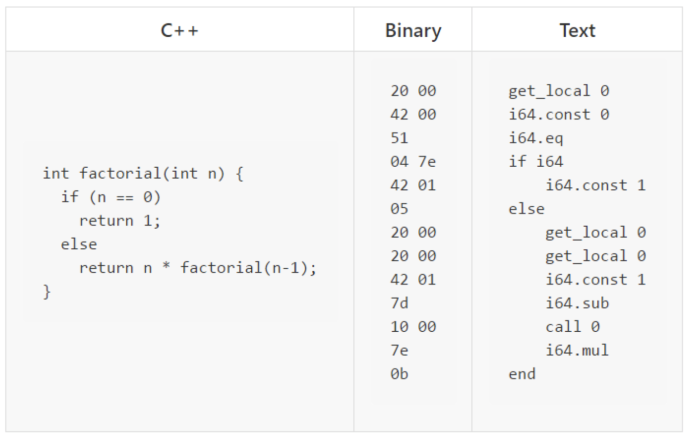

# WebAssembly

## 历程
+ 2015年4月-[WebAssembly社区小组](https://www.w3.org/community/webassembly)成立
- ...[过去的里程碑](https://www.wasm.com.cn/roadmap/)
+ 2017年3月- [跨浏览器共识](https://lists.w3.org/Archives/Public/public-webassembly/2017Feb/0002.html)并结束了浏览器预览
- 2019年12月5日- [WebAssembly 核心规范](https://www.w3.org/TR/wasm-core-1/)成为了正式的 Web 标准, 继 HTML、CSS 和 JavaScript 之后，正式成为第四个在浏览器中可原生运行的语言。

## 何为WebAssembly
### 概述
一种低层次的、安全的、可移植的类汇编语言，具有紧凑的二进制格式，可以接近原生的性能运行，并为诸如C / C ++等语言提供一个编译目标，以便它们可以在Web上运行.它也被设计为可以与JavaScript共存，允许两者一起工作(通过WebAssembly JS API)。

### 直观模样
::: details


左侧是用C++实现的求递归的函数。右侧是指令文本。而中间的十六进制Binary Code就是webassembly。

WebAssembly的可读性非常差，这是因为WebAssembly是一个编译目标（编译目标就比如：当我们写TypeScript的时候，Webpack最后打包生成的JavaScript文件就是编译目标），是**从高级语言转换到机器指令文本间的胶接代码(glue code)**。上图的Binary就是左侧的C++代码经过编译器编译之后的结果。
:::

## 既生JS何生WebAssembly
### 明确关系
WebAssembly并没有要替代JavaScript的意思，而是**互为补充**的。总结下来就两个点：
+ 给了Web**更好的性能**。WebAssembly是asm.js的性能的2~6倍；
+ 给了Web更多的可能。随着WebAssembly的技术越来越成熟，势必会有更多的应用，从Desktop被搬到Web上，这会使本来已经十分强大的Web更加丰富和强大。

### WebAssembly诞生背景
#### JavaScript的性能瓶颈：
JavaScript于95年问世，在前 10 个年头执行速度确实不快。在08年，浏览器市场竞争激烈，打响“性能大战”，浏览器厂商纷纷引入了 Just-in-time 编译器，也叫 JIT模式，JS的执行速度快了10倍，JS也终于应用到了新的领域，比如后端开发nodejs。

+ **JIT编译（just-in-time compilation）** 狭义来说是当某段代码即将第一次被执行时进行编译，因而叫“即时编译”。JIT编译是动态编译的一种特例。JIT编译一词后来被 泛化，时常与动态编译等价。
+ **动态编译（dynamic compilation）** 指的是“在运行时进行编译”；与之相对的是事前编译（ahead-of-time compilation，简称AOT），也叫静态编译（static compilation）。

JS没有静态变量类型，大大降低了效率：
+ **js代码在引擎中的执行过程：** 需要首先被下载，然后进入parser转成AST（抽象语法树），然后根据AST，Bytecode Compiler（字节码编译器）会生成引擎可识别的bytecode（字节码），最后字节码进入翻译器翻译成 Machine Code（机器码）。
+ **效率为啥低：** 引擎会对执行次数较多的function进行优化，将其编译成Machine Code后打包送到顶部的 JIT Compiler，下次再执行这个function，就会直接执行编译好的Machine Code。但是由于JS的动态变量，类型变化后上一次所做的优化就失效了只能丢弃，再一次进行优化，因此效率低。

#### Asm.js出现
为了解决js低性能问题，asm.js诞生了，它是WebAssembly的前身，是JavaScript的严格子集。Asm.js也不是给开发者手写的，也是一个编译目标。

+ Asm.js 为了解决JS的两个低性能问题而设计的：它的变量一律都是**静态类型**，并且**取消垃圾回收机制**。
    - Asm.js只提供两种数据类型：整数和浮点数，其他类型均不提供，其他类型均以数值的形式存在。Asm.js 要求事先声明类型且不得改变，这样就节省了类型判断的时间。asm.js的类型声明有固定写法，**变量 | **0表示整数，**+变量**表示浮点数。
    - asm.js 没有垃圾回收机制，所有内存操作都由程序员自己控制。
    ```js
    var a = 1;

    var x = a | 0;  // x 是32位整数
    var y = +a;  // y 是64位浮点数
    ```

+ Asm.js不能解决所有的问题：
    - asm.js 始终逃不过要经过Parser，要经过ByteCode Compiler，而这两步是JavaScript代码在引擎执行过程当中消耗时间最多的两步。而WebAssembly不用经过这两步，直接就是bytecode（字节码）。这就是WebAssembly比asm.js更快的原因。
    - asm.js只有Mozzila支持，而WebAssembly是Mozzila、Google、Microsoft、Apple以及一些其他组织拟联手制定的游戏规则，是业界大佬的统一规范。

#### WebAssembly应用而生
在上述背景之下，15年，我们迎来了WebAssembly。WebAssembly是经过编译器编译之后的代码，体积小、起步快。在语法上完全脱离JavaScript，同时具有沙盒化的执行环境，成为一个相对独立的编译器目标语言，这样可以不必为了本地代码的运行，而在JS中引入太多内容，将来Wasm和JS会是分工合作的关系。

## WebAssembly实操
必须要安装 编译器**Emscripten**，建议阅读[开发者引导](https://www.wasm.com.cn/getting-started/developers-guide/)，同时还需要使用WebAssembly JS API([API参考](https://developer.mozilla.org/zh-CN/docs/WebAssembly#API%E5%8F%82%E8%80%83))。

1. WebAssembly在Node中的应用：
```js
const fs = require('fs');
let src = new Uint8Array(fs.readFileSync('./test.wasm'));
const env = {
	memoryBase: 0,
	tableBase: 0,
	memory: new WebAssembly.Memory({
		initial: 256
	}),
	table: new WebAssembly.Table({
		initial: 2,
		element: 'anyfunc'
	}),
	abort: () => {throw 'abort';}
}
WebAssembly.instantiate(src, {env: env})
.then(result => {
	console.log(result.instance.exports._add(20, 89));
})
.catch(e => console.log(e));
```

2. WebAssembly在React当中的应用:

+ **add.c**（简单加法和斐波那契）
``` C
#include <stdio.h>

int add(int a, int b) {
   return a + b;
}

int fibonacci(int n) {
    if (n <= 1) {
        return n;
    } else {
        return fibonacci(n - 1) + fibonacci(n - 2);
    }
}
```

+ **App.js**
```js
import React, {Component} from 'react';
import fetch from 'node-fetch';
import './App.css';
import wasmC from './add.c';

class App extends Component {
  constructor() {
    super();
    this.state = {
      jsFibonacci: null,
      cFibonacci: null
    }
  }

  componentDidMount() {
    wasmC({
      'global': {},
      'env': {
        'memoryBase': 0,
        'tableBase': 0,
        'memory': new WebAssembly.Memory({initial: 256}),
        'table': new WebAssembly.Table({initial: 0, element: 'anyfunc'})
      }
    }).then(result => {
      const exports = result.instance.exports;
      const add = exports.add;
      const fibonacci = exports.fibonacci;
      console.log('C return value was', add(2, 3));
      console.log('Fibonacci', fibonacci(2));
    });

    this.doSomething();
  }

  getExportFunction = async (url) => {
    const env = {
      memoryBase: 0,
      tableBase: 0,
      memory: new WebAssembly.Memory({
        initial: 256
      }),
      table: new WebAssembly.Table({
        initial: 2,
        element: 'anyfunc'
      })
    };
    const instance = await fetch(url).then((response) => {
      return response.arrayBuffer();
    }).then((bytes) => {
      return WebAssembly.instantiate(bytes, {env: env})
    }).then((instance) => {
      return instance.instance.exports;
    });
    return instance;
  };

  fibonacci = (n) => {
    if (n <= 1) {
      return n;
    } else {
      return this.fibonacci(n - 1) + this.fibonacci(n - 2);
    }
  }

  doSomething = async () => {
    const fibonacciUrl = './fibonacci.wasm';
    const {_fibonacci} = await this.getExportFunction(fibonacciUrl);

    this.setState({
      cFibonacci: this.getDuring(_fibonacci),
      jsFibonacci: this.getDuring(this.fibonacci)
    })
  };

  getDuring(func) {
    const start = Date.now();
    func(40);
    return Date.now() - start;
  }

  render() {
    console.log(this.state);
    return (
      <div className="App">
        <header className="App-header">
          <h2>测试计算递归无优化的斐波那契数列性能</h2>
          <h3>当值为 41 时</h3>
          <span>Javascript实现的斐波那契函数耗费： {this.state.jsFibonacci} ms</span>
          <span>C实现的斐波那契函数耗费： {this.state.cFibonacci} ms</span>
        </header>
      </div>
    );
  }
}

export default App;
```

## 参考链接
+ [WebAssembly 官方文档](https://www.wasm.com.cn/roadmap/)
+ [MDN WebAssembly](https://developer.mozilla.org/zh-CN/docs/WebAssembly)
+ [几张图让你看懂WebAssembly](https://www.jianshu.com/p/bff8aa23fe4d)
